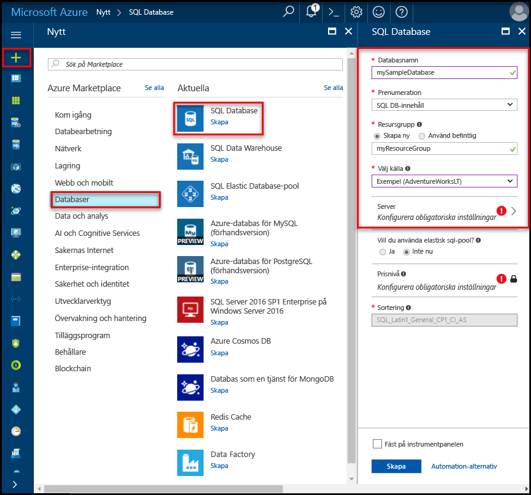

# <a name="create-an-azure-sql-database-in-hello-azure-portal"></a>Skapa en Azure SQL database i hello Azure-portalen

Den här snabbstartskursen går igenom hur toocreate en SQL-databas i Azure. Azure SQL Database är en ”databas-as-a-Service” erbjudande som du kan använda toorun och skala högtillgänglig SQL Server-databaser i hello molnet. Den här snabbstartsguide visar hur tooget igång genom att skapa en SQL-databas med hjälp av hello Azure-portalen.

Om du inte har en Azure-prenumeration kan du skapa ett [kostnadsfritt](https://azure.microsoft.com/free/) konto innan du börjar.

## <a name="log-in-toohello-azure-portal"></a>Logga in toohello Azure-portalen

Logga in toohello [Azure-portalen](https://portal.azure.com/).

## <a name="create-a-sql-database"></a>Skapa en SQL-databas

Azure SQL-databasen skapas med en definierad uppsättning [beräknings-och lagringsresurser](sql-database-service-tiers.md). hello-databas skapas inom en [Azure-resursgrupp](../azure-resource-manager/resource-group-overview.md) och i en [logisk Azure SQL Database-server](sql-database-features.md). 

Följ dessa steg toocreate en SQL-databas som innehåller hello Adventure Works LT exempeldata. 

1. Klicka på hello **ny** knappen hittades på hello övre vänstra hörnet av hello Azure-portalen.

2. Välj **databaser** från hello **ny** och väljer **SQL-databas** från hello **databaser** sidan.

   

3. Fyll i formuläret om hello SQL-databas med hello följande information som visas i föregående bild hello:   

   | Inställning       | Föreslaget värde | Beskrivning | 
   | ------------ | ------------------ | ------------------------------------------------- | 
   | **Databasnamn** | mySampleDatabase | För giltiga databasnamn, se [databasidentifierare](https://docs.microsoft.com/en-us/sql/relational-databases/databases/database-identifiers). | 
   | **Prenumeration** | Din prenumeration  | Mer information om dina prenumerationer finns i [Prenumerationer](https://account.windowsazure.com/Subscriptions). |
   | **Resursgrupp**  | myResourceGroup | Giltiga resursgruppnamn finns i [Namngivningsregler och begränsningar](https://docs.microsoft.com/azure/architecture/best-practices/naming-conventions). |
   | **Källa källa** | Exempel: (AdventureWorksLT) | Läser in hello AdventureWorksLT schema och data i den nya databasen |

   > [!IMPORTANT]
   > Du måste välja hello exempeldatabasen i det här formuläret eftersom den används i hello resten av den här snabbstartsguide.
   > 

4. Under **Server**, klickar du på **konfigurera nödvändiga inställningar** och registrerar hello SQL server (logisk server) formulär med hello följande information som visas i följande bild hello:   

   | Inställning       | Föreslaget värde | Beskrivning | 
   | ------------ | ------------------ | ------------------------------------------------- | 
   | **Servernamn** | Valfritt globalt unikt namn | Giltiga servernamn finns i [Namngivningsregler och begränsningar](https://docs.microsoft.com/azure/architecture/best-practices/naming-conventions). | 
   | **Inloggning för serveradministratör** | Valfritt giltigt namn | För giltiga inloggningsnamn, se [Databasidentifierare](https://docs.microsoft.com/en-us/sql/relational-databases/databases/database-identifiers). |
   | **Lösenord** | Valfritt giltigt lösenord | Lösenordet måste innehålla minst 8 tecken och måste innehålla tecken från tre av hello följande kategorier: versaler, gemener, siffror och och icke-alfanumeriska tecken. |
   | **Prenumeration** | Din prenumeration | Mer information om dina prenumerationer finns i [Prenumerationer](https://account.windowsazure.com/Subscriptions). |
   | **Resursgrupp** | myResourceGroup | Giltiga resursgruppnamn finns i [Namngivningsregler och begränsningar](https://docs.microsoft.com/azure/architecture/best-practices/naming-conventions). |
   | **Plats** | Valfri giltig plats | För information om regioner, se [Azure-regioner](https://azure.microsoft.com/regions/). |

   > [!IMPORTANT]
   > hello server admin inloggningsnamn och lösenord som du anger här är nödvändig toolog i toohello server och databaserna senare i den här snabbstartsguide. Kom ihåg eller skriv ned den här informationen så att du kan använda den senare. 
   >  

   

5. När du har slutfört hello formuläret, klickar du på **Välj**.

6. Klicka på **prisnivå** toospecify hello tjänstnivå och prestandanivå servicenivå för den nya databasen. Använd hello skjutreglaget tooselect **20 dtu: er** och **250** GB lagringsutrymme. Mer information om DTU:er finns i [Vad är en DTU?](sql-database-what-is-a-dtu.md)

   

7. När valda hello mängden dtu: er, klickar du på **tillämpa**.  

8. Nu när du har slutfört hello SQL Database formuläret, klickar du på **skapa** tooprovision hello-databasen. Etableringen tar några minuter. 

9. På verktygsfältet hello **meddelanden** toomonitor hello distributionsprocessen.

   

## <a name="create-a-server-level-firewall-rule"></a>Skapa en brandväggsregel på servernivå

hello SQL Database-tjänsten skapar en brandvägg på hello-servernivå som förhindrar att externa program och verktyg ansluter toohello server eller en databas på servern hello såvida inte en brandväggsregel skapas tooopen hello-brandväggen för specifika IP-adresser. Följ dessa steg toocreate en [SQL-databas brandväggsregel på servernivå](sql-database-firewall-configure.md) för din klients IP-adress och aktivera extern anslutning via hello SQL Database-Brandvägg för din IP-adress. 

> [!NOTE]
> SQL Database kommunicerar via port 1433. Om du försöker tooconnect från ett företagsnätverk, tillåtas utgående trafik via port 1433 inte av ditt nätverks brandvägg. I så fall, kan du inte ansluta tooyour Azure SQL Database-server om din IT-avdelning öppnar port 1433.
>

1. När hello distributionen är klar klickar du på **SQL-databaser** från hello vänstra menyn och klicka sedan på **mySampleDatabase** på hello **SQL-databaser** sidan. hello översiktssidan för din databas öppnas som visar du hello fullständigt kvalificerade servernamnet (exempelvis **mynewserver20170313.database.windows.net**) och innehåller alternativ för ytterligare konfiguration. Kopiera det fullständiga servernamnet för senare användning.

   > [!IMPORTANT]
   > Du behöver den här fullständigt kvalificerade namnet tooconnect tooyour-server och dess databaser i efterföljande snabbstarter.
   > 

    

2. Klicka på **ange serverbrandvägg** hello verktygsfältet enligt hello föregående bild. Hej **brandväggsinställningar** öppnas sidan för hello SQL Database-server. 

    

3. Klicka på **lägga till klientens IP-Adressen** på hello verktygsfältet tooadd din aktuella IP-adressen tooa ny brandväggsregel. Med en brandväggsregel kan du öppna port 1433 för en enskild IP-adress eller för IP-adressintervall.

4. Klicka på **Spara**. En brandväggsregel på servernivå har skapats för din aktuella IP-adress som är öppna port 1433 på hello logisk server.

    

4. Klicka på **OK** och stäng sedan hello **brandväggsinställningar** sidan.

Nu kan du ansluta toohello SQL Database-server och dess databaser med SQL Server Management Studio eller ett annat verktyg som helst från den här IP-adressen med hello server administratörskonto som skapats tidigare.

> [!IMPORTANT]
> Som standard är åtkomst via hello SQL Database-brandvägg aktiverad för alla Azure-tjänster. Klicka på **OFF** på den här sidan toodisable för alla Azure-tjänster.
>

## <a name="query-hello-sql-database"></a>Frågan hello SQL-databas

Nu när du har skapat en exempeldatabas i Azure kan vi verktyget hello inbyggda frågan inom hello Azure portal tooconfirm att du kan ansluta toohello databasen och fråga hello-data. 

1. På hello SQL-databasen för databasen klickar du på **verktyg** hello i verktygsfältet. Hej **verktyg** öppnas.

    

2. Klicka på **frågeredigeraren (förhandsgranskning)**, klickar du på hello **Förhandsgranska villkoren** kryssrutan och klicka sedan på **OK**. hello Query editor sidan öppnas.

3. Klicka på **inloggning** och när du uppmanas, markera **SQL server-autentisering** och ange sedan hello inloggning för serveradministratör och lösenord som du skapade tidigare.

    

4. Klicka på **OK** toolog i.

5. När du är autentiserad fråga typen hello följande i hello query editor-fönstret.

   ```sql
   SELECT TOP 20 pc.Name as CategoryName, p.name as ProductName
   FROM SalesLT.ProductCategory pc
   JOIN SalesLT.Product p
   ON pc.productcategoryid = p.productcategoryid;
   ```

6. Klicka på **kör** och granska sedan hello frågeresultaten i hello **resultat** fönstret.

   

7. Stäng hello **frågeredigeraren** sida och hello **verktyg** sidan.

## <a name="clean-up-resources"></a>Rensa resurser

Om du inte behöver dessa resurser för en annan Snabbstartsguide (se [nästa steg](#next-steps)), kan du ta bort dem genom att göra hello följande:


1. Hello vänstra menyn i hello Azure-portalen klickar du på **resursgrupper** och klicka sedan på **myResourceGroup**. 
2. På din resurs gruppen klickar du på **ta bort**, typen **myResourceGroup** i hello textrutan och klicka sedan på **ta bort**.

## <a name="next-steps"></a>Nästa steg

Nu när du har en databas kan du ansluta och söka med dina favoritverktyg. Lär dig mer genom att välja verktyg nedan:

- [SQL Server Management Studio](sql-database-connect-query-ssms.md)
- [Visual Studio Code](sql-database-connect-query-vscode.md)
- [NET](sql-database-connect-query-dotnet.md)
- [PHP](sql-database-connect-query-php.md)
- [Node.js](sql-database-connect-query-nodejs.md)
- [Java](sql-database-connect-query-java.md)
- [Python](sql-database-connect-query-python.md)
- [Ruby](sql-database-connect-query-ruby.md)
