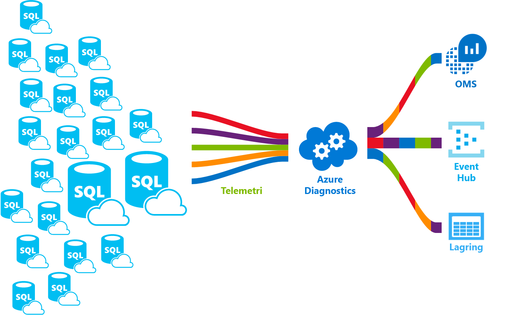

# <a name="azure-sql-database-metrics-and-diagnostics-logging"></a><span data-ttu-id="96813-103">Azure SQL Database-mätvärden och diagnostikloggning</span><span class="sxs-lookup"><span data-stu-id="96813-103">Azure SQL Database metrics and diagnostics logging</span></span> 
<span data-ttu-id="96813-104">Azure SQL Database kan sända mått och diagnostikloggar för lättare övervakning.</span><span class="sxs-lookup"><span data-stu-id="96813-104">Azure SQL Database can emit metrics and diagnostic logs for easier monitoring.</span></span> <span data-ttu-id="96813-105">Du kan konfigurera Azure SQL Database för att lagra Resursanvändning, personal och sessioner och anslutning till en av dessa Azure-resurser:</span><span class="sxs-lookup"><span data-stu-id="96813-105">You can configure Azure SQL Database to store resource usage, workers and sessions, and connectivity into one of these Azure resources:</span></span>
- <span data-ttu-id="96813-106">**Azure Storage**: För arkivering av stora mängder telemetri till ett lågt pris</span><span class="sxs-lookup"><span data-stu-id="96813-106">**Azure Storage**: For archiving vast amounts of telemetry for a small price</span></span>
- <span data-ttu-id="96813-107">**Azure Event Hub**: för att integrera Azure SQL Database telemetri med anpassade övervakningslösning eller varm pipelines</span><span class="sxs-lookup"><span data-stu-id="96813-107">**Azure Event Hub**: For integrating Azure SQL Database telemetry with your custom monitoring solution or hot pipelines</span></span>
- <span data-ttu-id="96813-108">**Azure logganalys**: för out of box övervakningslösning med reporting, varningar och minimera funktioner</span><span class="sxs-lookup"><span data-stu-id="96813-108">**Azure Log Analytics**: For out of the box monitoring solution with reporting, alerting, and mitigating capabilities</span></span> 

    

## <a name="enable-logging"></a><span data-ttu-id="96813-110">Aktivera loggning</span><span class="sxs-lookup"><span data-stu-id="96813-110">Enable logging</span></span>

<span data-ttu-id="96813-111">Mätvärden och diagnostikfunktionerna loggning är inte aktiverad som standard.</span><span class="sxs-lookup"><span data-stu-id="96813-111">Metrics and diagnostics logging is not enabled by default.</span></span> <span data-ttu-id="96813-112">Du kan aktivera och hantera mått och diagnostik loggning genom att använda någon av följande metoder:</span><span class="sxs-lookup"><span data-stu-id="96813-112">You can enable and manage metrics and diagnostics logging using one of the following methods:</span></span>
- <span data-ttu-id="96813-113">Azure Portal</span><span class="sxs-lookup"><span data-stu-id="96813-113">Azure portal</span></span>
- <span data-ttu-id="96813-114">PowerShell</span><span class="sxs-lookup"><span data-stu-id="96813-114">PowerShell</span></span>
- <span data-ttu-id="96813-115">Azure CLI</span><span class="sxs-lookup"><span data-stu-id="96813-115">Azure CLI</span></span>
- <span data-ttu-id="96813-116">REST API</span><span class="sxs-lookup"><span data-stu-id="96813-116">REST API</span></span> 
- <span data-ttu-id="96813-117">Resource Manager-mall</span><span class="sxs-lookup"><span data-stu-id="96813-117">Resource Manager template</span></span>

<span data-ttu-id="96813-118">Du måste ange Azure-resurs där valda data samlas in när du aktiverar mått och diagnostikloggning.</span><span class="sxs-lookup"><span data-stu-id="96813-118">When you enable metrics and diagnostics logging, you need to specify the Azure resource where selected data is collected.</span></span> <span data-ttu-id="96813-119">Tillgängliga alternativ:</span><span class="sxs-lookup"><span data-stu-id="96813-119">Options available:</span></span>
- <span data-ttu-id="96813-120">Log Analytics</span><span class="sxs-lookup"><span data-stu-id="96813-120">Log analytics</span></span>
- <span data-ttu-id="96813-121">Händelsehubb</span><span class="sxs-lookup"><span data-stu-id="96813-121">Event Hub</span></span>
- <span data-ttu-id="96813-122">Azure Storage</span><span class="sxs-lookup"><span data-stu-id="96813-122">Azure Storage</span></span> 

<span data-ttu-id="96813-123">Du kan etablera en ny resurs i Azure eller välj en befintlig resurs.</span><span class="sxs-lookup"><span data-stu-id="96813-123">You can provision a new Azure resource or select an existing resource.</span></span> <span data-ttu-id="96813-124">Du måste ange vilka data som ska samlas in när du har valt storage-resursen.</span><span class="sxs-lookup"><span data-stu-id="96813-124">After selecting the storage resource, you need to specify which data to collect.</span></span> <span data-ttu-id="96813-125">Alternativen är:</span><span class="sxs-lookup"><span data-stu-id="96813-125">Options available include:</span></span>

- <span data-ttu-id="96813-126">**[1 minut mått](sql-database-metrics-diag-logging.md#1-minute-metrics)**  -innehåller DTU-procent, DTU gränsen, CPU-procent fysiska data läsa procent, Log skriva procent, lyckade/misslyckade/Blocked av brandväggens anslutningar, sessioner procent, arbetare procent lagring, lagringsprocent, XTP-lagringsprocent</span><span class="sxs-lookup"><span data-stu-id="96813-126">**[1-minute metrics](sql-database-metrics-diag-logging.md#1-minute-metrics)** - contains DTU percentage, DTU limit, CPU percentage, Physical data read percentage, Log write percentage, Successful/Failed/Blocked by firewall connections, sessions percentage, workers percentage, storage, storage percentage, XTP storage percentage</span></span>

<span data-ttu-id="96813-127">Om du anger Event Hub eller ett AzureStorage konto kan ange du en bevarandeprincip ange att data som är äldre än en vald tidsperiod tas bort.</span><span class="sxs-lookup"><span data-stu-id="96813-127">If you specify Event Hub or an AzureStorage account, you can specify a retention policy to specify that data that is older than a selected time period is deleted.</span></span> <span data-ttu-id="96813-128">Om du anger logganalys beror bevarandeprincipen på den valda prisnivån.</span><span class="sxs-lookup"><span data-stu-id="96813-128">If you specify Log Analytics, the retention policy depends on the selected pricing tier.</span></span> <span data-ttu-id="96813-129">Läs mer om [logganalys priser](https://azure.microsoft.com/pricing/details/log-analytics/).</span><span class="sxs-lookup"><span data-stu-id="96813-129">Read more about [Log Analytics pricing](https://azure.microsoft.com/pricing/details/log-analytics/).</span></span> 

<span data-ttu-id="96813-130">Vi rekommenderar att du läser både den [översikt över mått i Microsoft Azure](../monitoring-and-diagnostics/monitoring-overview-metrics.md) och [översikt av Azure diagnostikloggar](../monitoring-and-diagnostics/monitoring-overview-of-diagnostic-logs.md) artiklar för att få en bättre förståelse av inte bara hur du aktiverar loggning, men mätvärdena och Logga kategorier som stöds av olika Azure-tjänster.</span><span class="sxs-lookup"><span data-stu-id="96813-130">We recommend that you read both the [Overview of metrics in Microsoft Azure](../monitoring-and-diagnostics/monitoring-overview-metrics.md) and [Overview of Azure Diagnostic Logs](../monitoring-and-diagnostics/monitoring-overview-of-diagnostic-logs.md) articles to gain an understanding of not only how to enable logging, but the metrics and log categories supported by the various Azure services.</span></span>

### <a name="azure-portal"></a><span data-ttu-id="96813-131">Azure Portal</span><span class="sxs-lookup"><span data-stu-id="96813-131">Azure portal</span></span>

<span data-ttu-id="96813-132">Om du vill aktivera mätvärden och diagnostikloggar samling i Azure portal, gå till din Azure SQL-databas eller en elastisk pool-sidan och klicka sedan på **diagnostikinställningar**.</span><span class="sxs-lookup"><span data-stu-id="96813-132">To enable metrics and diagnostic logs collection in the Azure portal, navigate to your Azure SQL database or elastic pool page, and then click **Diagnostic settings**.</span></span>

   

### <a name="powershell"></a><span data-ttu-id="96813-134">PowerShell</span><span class="sxs-lookup"><span data-stu-id="96813-134">PowerShell</span></span>

<span data-ttu-id="96813-135">Om du vill aktivera mätvärden och diagnostikloggning med hjälp av PowerShell använder du följande kommandon:</span><span class="sxs-lookup"><span data-stu-id="96813-135">To enable metrics and diagnostics logging using PowerShell, use the following commands:</span></span>

- <span data-ttu-id="96813-136">Använd följande kommando för att aktivera lagring av diagnostiska loggar i ett Lagringskonto:</span><span class="sxs-lookup"><span data-stu-id="96813-136">To enable storage of Diagnostic Logs in a Storage Account, use this command:</span></span>

   ```powershell
   Set-AzureRmDiagnosticSetting -ResourceId [your resource id] -StorageAccountId [your storage account id] -Enabled $true
   ```

   <span data-ttu-id="96813-137">Storage-konto-ID är resurs-id för lagringskontot som du vill skicka loggar.</span><span class="sxs-lookup"><span data-stu-id="96813-137">The Storage Account ID is the resource id for the storage account to which you want to send the logs.</span></span>

- <span data-ttu-id="96813-138">Om du vill aktivera strömning av diagnostiska loggar till en Händelsehubb, Använd följande kommando:</span><span class="sxs-lookup"><span data-stu-id="96813-138">To enable streaming of Diagnostic Logs to an Event Hub, use this command:</span></span>

   ```powershell
   Set-AzureRmDiagnosticSetting -ResourceId [your resource id] -ServiceBusRuleId [your service bus rule id] -Enabled $true
   ```

   <span data-ttu-id="96813-139">Regel-ID för Service Bus är en sträng med formatet:</span><span class="sxs-lookup"><span data-stu-id="96813-139">The Service Bus Rule ID is a string with this format:</span></span>

   ```powershell
   {service bus resource ID}/authorizationrules/{key name}
   ``` 

- <span data-ttu-id="96813-140">Använd följande kommando för att aktivera sändning av diagnostiska loggar till en logganalys-arbetsyta:</span><span class="sxs-lookup"><span data-stu-id="96813-140">To enable sending of Diagnostic Logs to a Log Analytics workspace, use this command:</span></span>

   ```powershell
   Set-AzureRmDiagnosticSetting -ResourceId [your resource id] -WorkspaceId [resource id of the log analytics workspace] -Enabled $true
   ```

- <span data-ttu-id="96813-141">Du kan hämta resurs-id för logganalys-arbetsytan med följande kommando:</span><span class="sxs-lookup"><span data-stu-id="96813-141">You can obtain the resource id of your Log Analytics workspace using the following command:</span></span>

   ```powershell
   (Get-AzureRmOperationalInsightsWorkspace).ResourceId
   ```

<span data-ttu-id="96813-142">Du kan kombinera dessa parametrar för att aktivera flera alternativ för utdata.</span><span class="sxs-lookup"><span data-stu-id="96813-142">You can combine these parameters to enable multiple output options.</span></span>

### <a name="cli"></a><span data-ttu-id="96813-143">CLI</span><span class="sxs-lookup"><span data-stu-id="96813-143">CLI</span></span>

<span data-ttu-id="96813-144">Om du vill aktivera mätvärden och diagnostikloggning med hjälp av Azure CLI, använder du följande kommandon:</span><span class="sxs-lookup"><span data-stu-id="96813-144">To enable metrics and diagnostics logging using the Azure CLI, use the following commands:</span></span>

- <span data-ttu-id="96813-145">Använd följande kommando för att aktivera lagring av diagnostiska loggar i ett Lagringskonto:</span><span class="sxs-lookup"><span data-stu-id="96813-145">To enable storage of Diagnostic Logs in a Storage Account, use this command:</span></span>

   ```azurecli-interactive
   azure insights diagnostic set --resourceId <resourceId> --storageId <storageAccountId> --enabled true
   ```

   <span data-ttu-id="96813-146">Storage-konto-ID är resurs-id för lagringskontot som du vill skicka loggar.</span><span class="sxs-lookup"><span data-stu-id="96813-146">The Storage Account ID is the resource id for the storage account to which you want to send the logs.</span></span>

- <span data-ttu-id="96813-147">Om du vill aktivera strömning av diagnostiska loggar till en Händelsehubb, Använd följande kommando:</span><span class="sxs-lookup"><span data-stu-id="96813-147">To enable streaming of Diagnostic Logs to an Event Hub, use this command:</span></span>

   ```azurecli-interactive
   azure insights diagnostic set --resourceId <resourceId> --serviceBusRuleId <serviceBusRuleId> --enabled true
   ```

   <span data-ttu-id="96813-148">Regel-ID för Service Bus är en sträng med formatet:</span><span class="sxs-lookup"><span data-stu-id="96813-148">The Service Bus Rule ID is a string with this format:</span></span>

   ```azurecli-interactive
   {service bus resource ID}/authorizationrules/{key name}
   ```

- <span data-ttu-id="96813-149">Använd följande kommando för att aktivera sändning av diagnostiska loggar till en logganalys-arbetsyta:</span><span class="sxs-lookup"><span data-stu-id="96813-149">To enable sending of Diagnostic Logs to a Log Analytics workspace, use this command:</span></span>

   ```azurecli-interactive
   azure insights diagnostic set --resourceId <resourceId> --workspaceId <resource id of the log analytics workspace> --enabled true
   ```

<span data-ttu-id="96813-150">Du kan kombinera dessa parametrar för att aktivera flera alternativ för utdata.</span><span class="sxs-lookup"><span data-stu-id="96813-150">You can combine these parameters to enable multiple output options.</span></span>

### <a name="rest-api"></a><span data-ttu-id="96813-151">REST API</span><span class="sxs-lookup"><span data-stu-id="96813-151">REST API</span></span>

<span data-ttu-id="96813-152">Läs mer om hur du [ändra diagnostikinställningar med hjälp av REST API för Azure-Monitor](https://msdn.microsoft.com/library/azure/dn931931.aspx).</span><span class="sxs-lookup"><span data-stu-id="96813-152">Read about how to [change Diagnostic settings using the Azure Monitor REST API](https://msdn.microsoft.com/library/azure/dn931931.aspx).</span></span> 

### <a name="resource-manager-template"></a><span data-ttu-id="96813-153">Resource Manager-mall</span><span class="sxs-lookup"><span data-stu-id="96813-153">Resource Manager template</span></span>

<span data-ttu-id="96813-154">Läs mer om hur du [aktivera diagnostikinställningar när resursen skapas med hjälp av Resource Manager-mall](../monitoring-and-diagnostics/monitoring-enable-diagnostic-logs-using-template.md).</span><span class="sxs-lookup"><span data-stu-id="96813-154">Read about how to [enable Diagnostic settings at resource creation using Resource Manager template](../monitoring-and-diagnostics/monitoring-enable-diagnostic-logs-using-template.md).</span></span> 

## <a name="stream-into-log-analytics"></a><span data-ttu-id="96813-155">Dataströmmen till logganalys</span><span class="sxs-lookup"><span data-stu-id="96813-155">Stream into Log Analytics</span></span> 
<span data-ttu-id="96813-156">Azure SQL Database-mätvärden och diagnostikloggar kan strömmas till logganalys med alternativet inbyggda ”skicka till logganalys” i portalen eller genom att aktivera logganalys i diagnostikinställningen via Azure PowerShell-cmdlet: ar, Azure CLI eller Azure övervakaren REST API.</span><span class="sxs-lookup"><span data-stu-id="96813-156">Azure SQL Database metrics and diagnostic logs can be streamed into Log Analytics using the built-in “Send to Log Analytics” option in the portal, or by enabling Log Analytics in a diagnostic setting via Azure PowerShell cmdlets, Azure CLI, or Azure Monitor REST API.</span></span>

### <a name="installation-overview"></a><span data-ttu-id="96813-157">Installationsöversikt</span><span class="sxs-lookup"><span data-stu-id="96813-157">Installation overview</span></span>

<span data-ttu-id="96813-158">Övervaka Azure SQL Database flottan är enkelt med logganalys.</span><span class="sxs-lookup"><span data-stu-id="96813-158">Monitoring Azure SQL Database fleet is simple with Log Analytics.</span></span> <span data-ttu-id="96813-159">Tre steg krävs:</span><span class="sxs-lookup"><span data-stu-id="96813-159">Three steps are required:</span></span>

1.  <span data-ttu-id="96813-160">Skapa resurs för logganalys</span><span class="sxs-lookup"><span data-stu-id="96813-160">Create Log Analytics resource</span></span>
2.  <span data-ttu-id="96813-161">Konfigurera databaser för att registrera mått och diagnostiska loggar till skapade logganalys</span><span class="sxs-lookup"><span data-stu-id="96813-161">Configure databases to record metrics and diagnostic logs into the created Log Analytics</span></span>
3.  <span data-ttu-id="96813-162">Installera **Azure SQL Analytics** lösningar från galleriet i logganalys</span><span class="sxs-lookup"><span data-stu-id="96813-162">Install **Azure SQL Analytics** solution from gallery in Log Analytics</span></span>

### <a name="create-log-analytics-resource"></a><span data-ttu-id="96813-163">Skapa resurs för logganalys</span><span class="sxs-lookup"><span data-stu-id="96813-163">Create Log Analytics resource</span></span>

1. <span data-ttu-id="96813-164">Klicka på **ny** i den vänstra menyn.</span><span class="sxs-lookup"><span data-stu-id="96813-164">Click **New** in the left-hand menu.</span></span>
2. <span data-ttu-id="96813-165">Klicka på **övervakning och hantering**</span><span class="sxs-lookup"><span data-stu-id="96813-165">Click **Monitoring + Management**</span></span>
3. <span data-ttu-id="96813-166">Klicka på **logga Analytics**</span><span class="sxs-lookup"><span data-stu-id="96813-166">Click **Log Analytics**</span></span>
4. <span data-ttu-id="96813-167">Fyll i formuläret logganalys med ytterligare information som krävs: arbetsytans namn, prenumeration, resursgrupp, plats och prisnivån.</span><span class="sxs-lookup"><span data-stu-id="96813-167">Fill in the Log Analytics form with the additional information required: workspace name, subscription, resource group, location, and pricing tier.</span></span>

   

### <a name="configure-databases-to-record-metrics-and-diagnostic-logs"></a><span data-ttu-id="96813-169">Konfigurera databaserna så att posten mått och diagnostikloggar</span><span class="sxs-lookup"><span data-stu-id="96813-169">Configure databases to record metrics and diagnostic logs</span></span>

<span data-ttu-id="96813-170">Det enklaste sättet att konfigurera där databaserna registrera sina mått är via Azure-portalen.</span><span class="sxs-lookup"><span data-stu-id="96813-170">The easiest way to configure where databases record their metrics is through the Azure portal.</span></span> <span data-ttu-id="96813-171">Navigera till din Azure SQL Database-resurs i Azure-portalen och på **diagnostikinställningarna**.</span><span class="sxs-lookup"><span data-stu-id="96813-171">In the Azure portal, navigate to your Azure SQL Database resource and click **Diagnostics settings**.</span></span> 

### <a name="install-the-azure-sql-analytics-solution-from-gallery"></a><span data-ttu-id="96813-172">Installera Azure SQL Analytics-lösning från galleriet</span><span class="sxs-lookup"><span data-stu-id="96813-172">Install the Azure SQL Analytics solution from gallery</span></span>  

1. <span data-ttu-id="96813-173">Installera Azure SQL Analytics lösning när resursen logganalys har skapats och dina data flödar till den.</span><span class="sxs-lookup"><span data-stu-id="96813-173">Once the Log Analytics resource is created and your data is flowing into it, install Azure SQL Analytics solution.</span></span> <span data-ttu-id="96813-174">Detta kan göras via den **lösningar galleriet** som du hittar på OMS-startsidan och på menyn sida.</span><span class="sxs-lookup"><span data-stu-id="96813-174">This can be done through the **Solutions Gallery** that you can find on the OMS homepage and in the side menu.</span></span> <span data-ttu-id="96813-175">Hitta i galleriet, och klicka på **Azure SQL Analytics** lösningen och klicka på **Lägg till**.</span><span class="sxs-lookup"><span data-stu-id="96813-175">In the gallery, find and click **Azure SQL Analytics** solution and click **Add**.</span></span>

   

2. <span data-ttu-id="96813-177">På startsidan OMS kallas en ny panel **Azure SQL Analytics** visas.</span><span class="sxs-lookup"><span data-stu-id="96813-177">On your OMS homepage, a new tile called **Azure SQL Analytics** appears.</span></span> <span data-ttu-id="96813-178">Markera den här panelen öppnar Azure SQL Analytics-instrumentpanelen.</span><span class="sxs-lookup"><span data-stu-id="96813-178">Selecting this tile opens the Azure SQL Analytics dashboard.</span></span>

### <a name="using-azure-sql-analytics-solution"></a><span data-ttu-id="96813-179">Med Azure SQL Analytics-lösning</span><span class="sxs-lookup"><span data-stu-id="96813-179">Using Azure SQL Analytics Solution</span></span>

<span data-ttu-id="96813-180">Azure SQL-Analytics är en hierarkisk instrumentpanel som gör att du kan navigera i hierarkin för Azure SQL Database-resurser.</span><span class="sxs-lookup"><span data-stu-id="96813-180">Azure SQL Analytics is a hierarchical dashboard that allows you to navigate through the hierarchy of Azure SQL Database resources.</span></span> <span data-ttu-id="96813-181">Den här funktionen kan du göra avancerade övervakning, men den också möjligt att begränsa övervakningen till precis rätt uppsättning resurser.</span><span class="sxs-lookup"><span data-stu-id="96813-181">This capability enables you to do high-level monitoring but it also enables you to scope your monitoring to just the right set of resources.</span></span>
<span data-ttu-id="96813-182">Instrumentpanelen innehåller listor över olika resurser under den valda resursen.</span><span class="sxs-lookup"><span data-stu-id="96813-182">Dashboard contains the lists of different resources under the selected resource.</span></span> <span data-ttu-id="96813-183">Till exempel för en vald prenumeration visas alla servrar, elastiska pooler och databaser som tillhör den valda prenumerationen.</span><span class="sxs-lookup"><span data-stu-id="96813-183">For example, for a selected subscription you can see the all servers, elastic pools and databases that belong to the selected subscription.</span></span> <span data-ttu-id="96813-184">Du kan dessutom se resurs användningsstatistik för resursen för elastiska pooler och databaser.</span><span class="sxs-lookup"><span data-stu-id="96813-184">Additionally, for Elastic Pools and databases, you can see the resource usage metrics of that resource.</span></span> <span data-ttu-id="96813-185">Detta inkluderar diagram för DTU, CPU, IO, LOG, sessioner, arbetare, anslutningar och lagringsutrymme i GB.</span><span class="sxs-lookup"><span data-stu-id="96813-185">This includes charts for DTU, CPU, IO, LOG, sessions, workers, connections, and storage in GB.</span></span>

## <a name="stream-into-azure-event-hub"></a><span data-ttu-id="96813-186">Dataströmmen till Azure Event Hub</span><span class="sxs-lookup"><span data-stu-id="96813-186">Stream into Azure Event Hub</span></span>

<span data-ttu-id="96813-187">Azure SQL Database-mätvärden och diagnostikloggar kan strömmas till Händelsehubb med hjälp av alternativet inbyggda ”dataströmmen till en händelsehubb” i portalen eller genom att aktivera Service Bus regel-Id i diagnostikinställningen via Azure PowerShell-Cmdlets, Azure CLI eller Azure övervakaren REST API.</span><span class="sxs-lookup"><span data-stu-id="96813-187">Azure SQL Database metrics and diagnostic logs can be streamed into Event Hub using the built-in “Stream to an event hub” option in the portal, or by enabling Service Bus Rule Id in a diagnostic setting via Azure PowerShell Cmdlets, Azure CLI, or Azure Monitor REST API.</span></span> 

### <a name="what-to-do-with-metrics-and-diagnostic-logs-in-event-hub"></a><span data-ttu-id="96813-188">Vad du gör med mått och diagnostikloggar i Event Hub?</span><span class="sxs-lookup"><span data-stu-id="96813-188">What to do with metrics and diagnostic logs in Event Hub?</span></span>
<span data-ttu-id="96813-189">När valda data strömmas till Event Hub, är du ett steg till att aktivera avancerade övervakningsscenarier.</span><span class="sxs-lookup"><span data-stu-id="96813-189">Once the selected data is streamed into Event Hub, you are one step closer to enabling advanced monitoring scenarios.</span></span> <span data-ttu-id="96813-190">Händelsehubbar fungerar som ”ytterdörren” för en händelsepipeline, och när data har samlats in i en händelsehubb kan du omvandla och lagra dessa data med hjälp av valfri leverantör av realtidsanalys eller med adaptrar för batchbearbetning/lagring.</span><span class="sxs-lookup"><span data-stu-id="96813-190">Event Hubs acts as the "front door" for an event pipeline, and once data is collected into an Event Hub, it can be transformed and stored using any real-time analytics provider or batching/storage adapters.</span></span> <span data-ttu-id="96813-191">Händelsehubbar frikopplar produktionen av en händelseström från användningen av dessa händelser så att händelsekonsumenterna kan komma åt dem på sitt eget schema.</span><span class="sxs-lookup"><span data-stu-id="96813-191">Event Hubs decouples the production of a stream of events from the consumption of those events, so that event consumers can access the events on their own schedule.</span></span> <span data-ttu-id="96813-192">För mer information om Event Hub, se:</span><span class="sxs-lookup"><span data-stu-id="96813-192">For more information on Event Hub, see:</span></span>

- <span data-ttu-id="96813-193">[Vad är Azure Event Hubs](../event-hubs/event-hubs-what-is-event-hubs.md)?</span><span class="sxs-lookup"><span data-stu-id="96813-193">[What are Azure Event Hubs](../event-hubs/event-hubs-what-is-event-hubs.md)?</span></span>
- [<span data-ttu-id="96813-194">Kom igång med Event Hubs</span><span class="sxs-lookup"><span data-stu-id="96813-194">Get started with Event Hubs</span></span>](../event-hubs/event-hubs-csharp-ephcs-getstarted.md)


<span data-ttu-id="96813-195">Här följer några olika sätt som du kan använda strömmande funktionen:</span><span class="sxs-lookup"><span data-stu-id="96813-195">Here are just a few ways you might use the streaming capability:</span></span>

-   <span data-ttu-id="96813-196">Visa tjänstens hälsa av strömmande ”varm path” data till PowerBI - med Händelsehubbar, Stream Analytics och PowerBI, kan du enkelt omvandla mätvärden och diagnostikfunktionerna data i nära realtidsinsikter på Azure-tjänster.</span><span class="sxs-lookup"><span data-stu-id="96813-196">View service health by streaming “hot path” data to PowerBI - Using Event Hubs, Stream Analytics, and PowerBI, you can easily transform your metrics and diagnostics data into near real-time insights on your Azure services.</span></span> <span data-ttu-id="96813-197">En översikt över hur du ställer in en Händelsehubbar, bearbetning av data med Stream Analytics och Använd PowerBI som utdata, se [Stream Analytics och Power BI](../stream-analytics/stream-analytics-power-bi-dashboard.md).</span><span class="sxs-lookup"><span data-stu-id="96813-197">For an overview of how to set up an Event Hubs, process data with Stream Analytics, and use PowerBI as an output, see [Stream Analytics and Power BI](../stream-analytics/stream-analytics-power-bi-dashboard.md).</span></span>
-   <span data-ttu-id="96813-198">Dataströmmen loggas till tredje parts loggning och telemetri dataströmmar – med Händelsehubbar direktuppspelning av du kan hämta din mätvärden och diagnostikloggar till olika tredje parts övervaknings- och log analytics lösningar.</span><span class="sxs-lookup"><span data-stu-id="96813-198">Stream logs to third-party logging and telemetry streams – Using Event Hubs streaming you can get your metrics and diagnostic logs in to different third-party monitoring and log analytics solutions.</span></span> 
-   <span data-ttu-id="96813-199">Skapa en anpassad telemetri och loggning plattform – om du redan har en specialbyggt telemetri plattform eller är bara du tänker skapa en mycket skalbar publicera och prenumerera uppbyggnad Händelsehubbar kan du flexibelt kan mata in diagnostikloggar.</span><span class="sxs-lookup"><span data-stu-id="96813-199">Build a custom telemetry and logging platform – If you already have a custom-built telemetry platform or are just thinking about building one, the highly scalable publish-subscribe nature of Event Hubs allows you to flexibly ingest diagnostic logs.</span></span> <span data-ttu-id="96813-200">Se [Dan Rosanova guide med Händelsehubbar i en global skala telemetri platform](https://azure.microsoft.com/documentation/videos/build-2015-designing-and-sizing-a-global-scale-telemetry-platform-on-azure-event-Hubs/).</span><span class="sxs-lookup"><span data-stu-id="96813-200">See [Dan Rosanova’s guide to using Event Hubs in a global scale telemetry platform](https://azure.microsoft.com/documentation/videos/build-2015-designing-and-sizing-a-global-scale-telemetry-platform-on-azure-event-Hubs/).</span></span>

## <a name="stream-into-azure-storage"></a><span data-ttu-id="96813-201">Dataströmmen till Azure Storage</span><span class="sxs-lookup"><span data-stu-id="96813-201">Stream into Azure Storage</span></span>

<span data-ttu-id="96813-202">Azure SQL Database-mätvärden och diagnostikloggar kan lagras i Azure Storage med hjälp av alternativet inbyggda ”Arkiv till ett lagringskonto” i Azure-portalen eller genom att aktivera Azure Storage i diagnostikinställningen via Azure PowerShell-Cmdlets, Azure CLI eller Azure-Monitor REST-API.</span><span class="sxs-lookup"><span data-stu-id="96813-202">Azure SQL Database metrics and diagnostic logs can be stored into Azure Storage using the built-in "Archive to a storage account” option in the Azure portal, or by enabling Azure Storage in a diagnostic setting via Azure PowerShell Cmdlets, Azure CLI, or Azure Monitor REST API.</span></span>

### <a name="schema-of-metrics-and-diagnostic-logs-in-the-storage-account"></a><span data-ttu-id="96813-203">Schemat för mått och diagnostikloggar i storage-konto</span><span class="sxs-lookup"><span data-stu-id="96813-203">Schema of metrics and diagnostic logs in the storage account</span></span>

<span data-ttu-id="96813-204">När du har konfigurerat mått och diagnostikloggar samling, skapas en lagringsbehållare i storage-konto som du har valt när de första raderna i data är tillgängliga.</span><span class="sxs-lookup"><span data-stu-id="96813-204">Once you have set up metrics and diagnostic logs collection, a storage container is created in the storage account you selected when the first rows of data are available.</span></span> <span data-ttu-id="96813-205">Strukturen för de här blobbar är:</span><span class="sxs-lookup"><span data-stu-id="96813-205">The structure of these blobs is:</span></span>

```powershell
insights-{metrics|logs}-{category name}/resourceId=/SUBSCRIPTIONS/{subscription ID}/ RESOURCEGROUPS/{resource group name}/PROVIDERS/Microsoft.SQL/servers/{resource_server}/ databases/{database_name}/y={four-digit numeric year}/m={two-digit numeric month}/d={two-digit numeric day}/h={two-digit 24-hour clock hour}/m=00/PT1H.json
```
    
<span data-ttu-id="96813-206">Eller att:</span><span class="sxs-lookup"><span data-stu-id="96813-206">Or, more simply:</span></span>

```powershell
insights-{metrics|logs}-{category name}/resourceId=/{resource Id}/y={four-digit numeric year}/m={two-digit numeric month}/d={two-digit numeric day}/h={two-digit 24-hour clock hour}/m=00/PT1H.json
```

<span data-ttu-id="96813-207">Till exempel kanske en blob-namnet för 1 minut mått:</span><span class="sxs-lookup"><span data-stu-id="96813-207">For example, a blob name for 1-minute metrics might be:</span></span>

```powershell
insights-metrics-minute/resourceId=/SUBSCRIPTIONS/s1id1234-5679-0123-4567-890123456789/RESOURCEGROUPS/TESTRESOURCEGROUP/PROVIDERS/MICROSOFT.SQL/ servers/Server1/databases/database1/y=2016/m=08/d=22/h=18/m=00/PT1H.json
```

<span data-ttu-id="96813-208">Om du vill registrera data från den elastiska poolen är blob-namnet något annat:</span><span class="sxs-lookup"><span data-stu-id="96813-208">In case you want to record the data from the Elastic Pool, blob name is a bit different:</span></span>

```powershell
insights-{metrics|logs}-{category name}/resourceId=/SUBSCRIPTIONS/{subscription ID}/ RESOURCEGROUPS/{resource group name}/PROVIDERS/Microsoft.SQL/servers/{resource_server}/ elasticPools/{elastic_pool_name}/y={four-digit numeric year}/m={two-digit numeric month}/d={two-digit numeric day}/h={two-digit 24-hour clock hour}/m=00/PT1H.json
```

### <a name="download-metrics-and-logs-from-azure-storage"></a><span data-ttu-id="96813-209">Hämta mätvärden och loggar från Azure storage</span><span class="sxs-lookup"><span data-stu-id="96813-209">Download metrics and logs from Azure storage</span></span>

<span data-ttu-id="96813-210">Se [hämta mätvärden och diagnostiska loggar från Azure Storage](../storage/blobs/storage-dotnet-how-to-use-blobs.md#download-blobs)</span><span class="sxs-lookup"><span data-stu-id="96813-210">See [Download metrics and diagnostic logs from Azure Storage](../storage/blobs/storage-dotnet-how-to-use-blobs.md#download-blobs)</span></span>

## <a name="1-minute-metrics"></a><span data-ttu-id="96813-211">1 minut mått</span><span class="sxs-lookup"><span data-stu-id="96813-211">1-minute metrics</span></span>

| |  |
|---|---|
|<span data-ttu-id="96813-212">**Resurs**</span><span class="sxs-lookup"><span data-stu-id="96813-212">**Resource**</span></span>|<span data-ttu-id="96813-213">**Mått**</span><span class="sxs-lookup"><span data-stu-id="96813-213">**Metrics**</span></span>|
|<span data-ttu-id="96813-214">Databas</span><span class="sxs-lookup"><span data-stu-id="96813-214">Database</span></span>|<span data-ttu-id="96813-215">DTU-procent DTU används, DTU gränsen, CPU-procent, fysiska data skrivskyddade procent loggen skriva procent, lyckade/misslyckade/Blocked av brandväggens anslutningar, sessioner procent, arbetare procent, lagring, lagringsprocent, XTP lagringsprocent deadlocks</span><span class="sxs-lookup"><span data-stu-id="96813-215">DTU percentage, DTU used, DTU limit, CPU percentage, Physical data read percentage, Log write percentage, Successful/Failed/Blocked by firewall connections, sessions percentage, workers percentage, storage, storage percentage, XTP storage percentage, deadlocks</span></span> |
|<span data-ttu-id="96813-216">Elastisk pool</span><span class="sxs-lookup"><span data-stu-id="96813-216">Elastic pool</span></span>|<span data-ttu-id="96813-217">eDTU procentandel eDTU används, eDTU gränsen, CPU-procent, fysiska data skrivskyddade procent, skriva loggen procent, sessioner procent, arbetare procent, lagring, lagringsprocent, lagringsgräns, XTP-lagringsprocent</span><span class="sxs-lookup"><span data-stu-id="96813-217">eDTU percentage, eDTU used, eDTU limit, CPU percentage, Physical data read percentage, Log write percentage, sessions percentage, workers percentage, storage, storage percentage, storage limit, XTP storage percentage</span></span> |
|||

## <a name="next-steps"></a><span data-ttu-id="96813-218">Nästa steg</span><span class="sxs-lookup"><span data-stu-id="96813-218">Next steps</span></span>

- <span data-ttu-id="96813-219">Läsa både den [översikt över mått i Microsoft Azure](../monitoring-and-diagnostics/monitoring-overview-metrics.md) och [översikt av Azure diagnostikloggar](../monitoring-and-diagnostics/monitoring-overview-of-diagnostic-logs.md) artiklar för att få en bättre förståelse av inte bara hur du aktiverar loggning, men kategorier mått och loggar stöd för olika Azure-tjänster.</span><span class="sxs-lookup"><span data-stu-id="96813-219">Read both the [Overview of metrics in Microsoft Azure](../monitoring-and-diagnostics/monitoring-overview-metrics.md) and [Overview of Azure Diagnostic Logs](../monitoring-and-diagnostics/monitoring-overview-of-diagnostic-logs.md) articles to gain an understanding of not only how to enable logging, but the metrics and log categories supported by the various Azure services.</span></span>
- <span data-ttu-id="96813-220">Läs artiklarna att lära dig om händelsehubbar:</span><span class="sxs-lookup"><span data-stu-id="96813-220">Read these articles to learn about event hubs:</span></span>
   - <span data-ttu-id="96813-221">[Vad är Azure Event Hubs](../event-hubs/event-hubs-what-is-event-hubs.md)?</span><span class="sxs-lookup"><span data-stu-id="96813-221">[What are Azure Event Hubs](../event-hubs/event-hubs-what-is-event-hubs.md)?</span></span>
   - [<span data-ttu-id="96813-222">Kom igång med Event Hubs</span><span class="sxs-lookup"><span data-stu-id="96813-222">Get started with Event Hubs</span></span>](../event-hubs/event-hubs-csharp-ephcs-getstarted.md)
- <span data-ttu-id="96813-223">Se [hämta mätvärden och diagnostiska loggar från Azure Storage](../storage/blobs/storage-dotnet-how-to-use-blobs.md#download-blobs)</span><span class="sxs-lookup"><span data-stu-id="96813-223">See [Download metrics and diagnostic logs from Azure Storage](../storage/blobs/storage-dotnet-how-to-use-blobs.md#download-blobs)</span></span>
