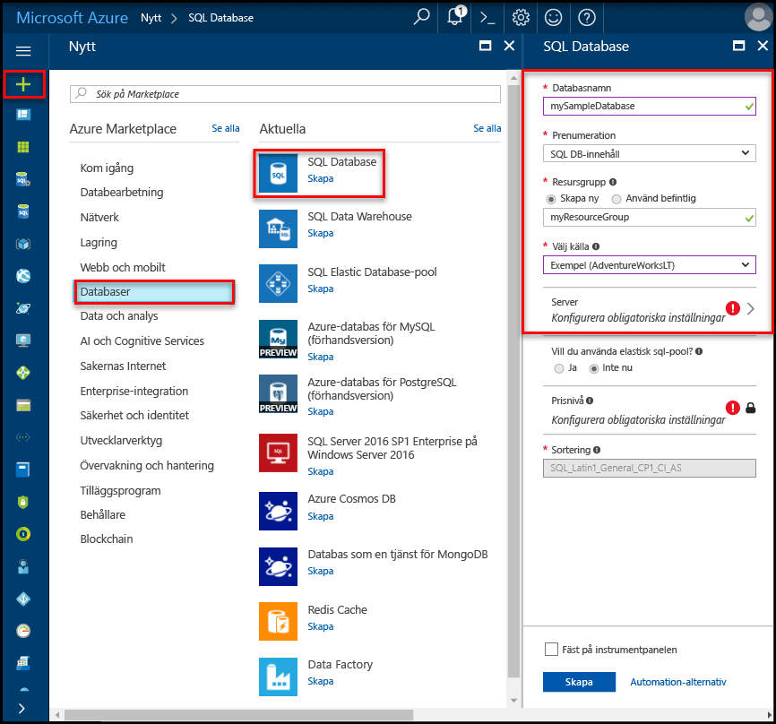

# Skapa och hantera Azure SQL Database-servrar och databaserCreate and manage Azure SQL Database servers and databases

En Azure SQL database är en hanterad databas i Microsoft Azure som skapas i en [Azure-resursgrupp](../azure-resource-manager/resource-group-overview.md) med en definierad uppsättning [beräkning och lagring resurser för olika arbetsbelastningar](sql-database-service-tiers.md).An Azure SQL database is a managed database in Microsoft Azure that is created within an [Azure resource group](../azure-resource-manager/resource-group-overview.md) with a defined set of [compute and storage resources for different workloads](sql-database-service-tiers.md). En Azure SQL database är associerad med en logisk server från Azure SQL Database som skapas i en viss Azure-region.An Azure SQL database is associated with an Azure SQL Database logical server, which is created within a specific Azure region. 

## En Azure SQL database kan vara en enskild, grupperade eller partitionerade databasAn Azure SQL database can be a single, pooled, or partitioned database

En Azure SQL database kan vara:An Azure SQL database can be:

- En enkel databas med dess [uppsättning resurser](sql-database-what-is-a-dtu.md#what-are-database-transaction-units-dtus) (DTU:er)A single database with its [own set of resources](sql-database-what-is-a-dtu.md#what-are-database-transaction-units-dtus) (DTUs)
- En del av en [elastiska SQL-poolen](sql-database-elastic-pool.md) som [delar en uppsättning resurser](sql-database-what-is-a-dtu.md#what-are-elastic-database-transaction-units-edtus) (edtu: er)Part of a [SQL elastic pool](sql-database-elastic-pool.md) that [shares a set of resources](sql-database-what-is-a-dtu.md#what-are-elastic-database-transaction-units-edtus) (eDTUs)
- En del av en [utskalad uppsättning delade databaser](sql-database-elastic-scale-introduction.md#horizontal-and-vertical-scaling), som kan vara enskilda databaser eller databaser i en poolPart of a [scaled-out set of sharded databases](sql-database-elastic-scale-introduction.md#horizontal-and-vertical-scaling), which can be either single or pooled databases
- En del av en uppsättning databaser som ingår i ett [SaaS-designmönster för flera klienter](sql-database-design-patterns-multi-tenancy-saas-applications.md), vars databaser kan vara enskilda databaser eller databaser i en pool (eller båda)Part of a set of databases participating in a [multitenant SaaS design pattern](sql-database-design-patterns-multi-tenancy-saas-applications.md), and whose databases can either be single or pooled databases (or both) 

> [!TIP]
> För giltiga databasnamn, se [databasidentifierare](https://docs.microsoft.com/en-us/sql/relational-databases/databases/database-identifiers).For valid database names, see [Database Identifiers](https://docs.microsoft.com/en-us/sql/relational-databases/databases/database-identifiers). 
>
 
- hello databasen Standardsortering används av Microsoft Azure SQL Database är **SQL_LATIN1_GENERAL_CP1_CI_AS**, där **LATIN1_GENERAL** är engelska (USA) **CP1** är teckentabellen 1252, **CI** är skiftlägeskänslig, och **AS** är accentkänsliga.hello default database collation used by Microsoft Azure SQL Database is **SQL_LATIN1_GENERAL_CP1_CI_AS**, where **LATIN1_GENERAL** is English (United States), **CP1** is code page 1252, **CI** is case-insensitive, and **AS** is accent-sensitive. Mer information om hur tooset hello sortering finns [COLLATE (Transact-SQL)](https://msdn.microsoft.com/library/ms184391.aspx).For more information about how tooset hello collation, see [COLLATE (Transact-SQL)](https://msdn.microsoft.com/library/ms184391.aspx).
- Microsoft Azure SQL Database stöder tabelldata dataström (TDS) protokollet klientversionen 7.3 eller senare.Microsoft Azure SQL Database supports tabular data stream (TDS) protocol client version 7.3 or later.
- TCP/IP-anslutningar tillåts.Only TCP/IP connections are allowed.

## Vad är en logisk Azure SQL-server?What is an Azure SQL logical server?

En logisk server som fungerar som en central administrativ plats för flera databaser, inklusive [SQL elastiska pooler](sql-database-elastic-pool.md) [inloggningar](sql-database-manage-logins.md), [regler i brandväggen](sql-database-firewall-configure.md), [granskning regler](sql-database-auditing.md), [hot principer](sql-database-threat-detection.md), och [redundans grupper](sql-database-geo-replication-overview.md).A logical server acts as a central administrative point for multiple databases, including [SQL elastic pools](sql-database-elastic-pool.md) [logins](sql-database-manage-logins.md), [firewall rules](sql-database-firewall-configure.md), [auditing rules](sql-database-auditing.md), [threat detection policies](sql-database-threat-detection.md), and [failover groups](sql-database-geo-replication-overview.md). En logisk server kan vara i en annan region än dess resursgruppen.A logical server can be in a different region than its resource group. hello logisk server måste finnas innan du kan skapa hello Azure SQL-databas.hello logical server must exist before you can create hello Azure SQL database. Alla databaser på en server som skapas i hello samma region som hello logisk server.All databases on a server are created within hello same region as hello logical server. 

> [!IMPORTANT]
> En server är en logisk konstruktion som skiljer sig från en SQL Server-instans som du kanske känner till lokala hälsningsmeddelande i SQL-databas.In SQL Database, a server is a logical construct that is distinct from a SQL Server instance that you may be familiar with in hello on-premises world. Mer specifikt hello SQL Database-tjänsten ger inga garantier om platsen för hello databaser i relationen tootheir logiska servrar och visar inga instansnivå åtkomst eller funktioner.Specifically, hello SQL Database service makes no guarantees regarding location of hello databases in relation tootheir logical servers, and exposes no instance-level access or features.
> 

När du skapar en logisk server kan ange du en server inloggningskonto och lösenord som har administrativa rättigheter toohello master-databasen på den servern och alla databaser som skapas på servern.When you create a logical server, you provide a server login account and password that has administrative rights toohello master database on that server and all databases created on that server. Det här första kontot är ett konto för SQL-inloggning.This initial account is a SQL login account. Azure SQL Database stöder SQL-autentisering och Azure Active Directory-autentisering för autentisering.Azure SQL Database supports SQL authentication and Azure Active Directory Authentication for authentication. Information om inloggning och autentisering finns [hantera databaser och inloggningar i Azure SQL Database](sql-database-manage-logins.md).For information about logins and authentication, see [Managing Databases and Logins in Azure SQL Database](sql-database-manage-logins.md). Windows-autentisering stöds inte.Windows Authentication is not supported. 

> [!TIP]
> Giltig resurs grupp- och servernamnen finns [namngivning av regler och begränsningar](https://docs.microsoft.com/azure/architecture/best-practices/naming-conventions).For valid resource group and server names, see [Naming rules and restrictions](https://docs.microsoft.com/azure/architecture/best-practices/naming-conventions).
>

En logisk Azure Database-server:An Azure Database logical server:

- Skapas i en Azure-prenumeration, men kan flyttas med befintliga resurser tooanother prenumerationenIs created within an Azure subscription, but can be moved with its contained resources tooanother subscription
- Är hello överordnade resurs för databaser och elastiska pooler datalagerIs hello parent resource for databases, elastic pools, and data warehouses
- Ger ett namnområde för databaser och elastiska pooler datalagerProvides a namespace for databases, elastic pools, and data warehouses
- En logisk behållare med starka livstid semantik - ta bort en server och tar bort är hello inneslutna databaser och elastiska pooler datalagerIs a logical container with strong lifetime semantics - delete a server and it deletes hello contained databases, elastic pools, and data warehouses
- Deltar i [Azure rollbaserad åtkomstkontroll (RBAC)](/active-directory/role-based-access-control-what-is) -databaser och elastiska pooler datalager på en server ärver behörigheter från hello-serverParticipates in [Azure role-based access control (RBAC)](/active-directory/role-based-access-control-what-is) - databases, elastic pools, and data warehouses within a server inherit access rights from hello server
- Är ett högsta-element för hello identiteten för databaser och elastiska pooler datalager för Azure-resurs hanteringsändamål (se hello URL-schema för databaser och pooler)Is a high-order element of hello identity of databases, elastic pools, and data warehouses for Azure resource management purposes (see hello URL scheme for databases and pools)
- Samlar resurser i en region.Collocates resources in a region
- Tillhandahåller en anslutningsslutpunkt för databasåtkomst (<serverName>.database.windows.net)Provides a connection endpoint for database access (<serverName>.database.windows.net)
- Tillhandahåller åtkomst toometadata om befintliga resurser via av DMV: er av anslutande tooa master-databasenProvides access toometadata regarding contained resources via DMVs by connecting tooa master database 
- Ger hello omfång för principer för hantering som gäller tooits databaser - inloggningar, brandvägg, granska, hot identifiering osv.Provides hello scope for management policies that apply tooits databases - logins, firewall, audit, threat detection, etc. 
- Begränsas av en kvot i hello överordnade prenumerationen (sex servrar per prenumeration som standard - [finns prenumeration begränsar här](../azure-subscription-service-limits.md))Is restricted by a quota within hello parent subscription (six servers per subscription by default - [see Subscription limits here](../azure-subscription-service-limits.md))
- Ger hello Omfattningen för databaskvoten och DTU-kvot för hello resurser som den innehåller (till exempel 45 000 DTU)Provides hello scope for database quota and DTU quota for hello resources it contains (such as 45,000 DTU)
- Är hello versionshantering omfattning för funktioner på befintliga resurserIs hello versioning scope for capabilities enabled on contained resources 
- Huvudkontoinloggningar på servernivå kan hantera alla databaser på en server.Server-level principal logins can manage all databases on a server
- Kan innehålla inloggningar liknande toothose i instanser av SQL Server på din lokala som beviljas åtkomst tooone eller flera databaser med hello server och kan vara begränsad beviljas administratörsbehörighet.Can contain logins similar toothose in instances of SQL Server on your premises that are granted access tooone or more databases on hello server, and can be granted limited administrative rights. Mer information finns i avsnittet om [inloggningar](sql-database-manage-logins.md).For more information, see [Logins](sql-database-manage-logins.md).

## Azure SQL-databaser som skyddas av Brandvägg för SQL-databasAzure SQL databases protected by SQL Database firewall

toohelp skydda dina data, en [SQL Database-brandvägg](sql-database-firewall-configure.md) förhindrar alla åtkomst tooyour database-server eller någon av dess databaser från utanför din anslutning toohello server direkt via Azure-prenumeration anslutningen.toohelp protect your data, a [SQL Database firewall](sql-database-firewall-configure.md) prevents all access tooyour database server or any of its databases from outside of your connection toohello server directly through your Azure subscription connection. tooenable ytterligare anslutningar, måste du [skapa brandväggsregler för en eller flera](sql-database-firewall-configure.md#creating-and-managing-firewall-rules).tooenable additional connectivity, you must [create one or more firewall rules](sql-database-firewall-configure.md#creating-and-managing-firewall-rules). Skapa och hantera SQL elastiska pooler finns [elastiska pooler](sql-database-elastic-pool.md).For creating and managing SQL elastic pools, see [Elastic pools](sql-database-elastic-pool.md).

## Hantera Azure SQL-servrar, databaser och brandväggar med hello Azure-portalenManage Azure SQL servers, databases, and firewalls using hello Azure portal

Du kan skapa hello Azure SQL database resursgrupp i förväg eller när du skapar hello-servern.You can create hello Azure SQL database's resource group ahead of time or while creating hello server itself. Det finns flera metoder för att hämta tooa nya SQL server formuläret, antingen genom att skapa en ny SQLServer eller som en del av att skapa en ny databas.There are multiple methods for getting tooa new SQL server form, either by creating a new SQL server or as part of creating a new database. 

### Skapa en tom SQLServer (logisk server)Create a blank SQL server (logical server)

en Azure SQL Database-server (utan en databas) med hjälp av toocreate hello [Azure-portalen](https://portal.azure.com), navigera tooa tomt SQL server (logisk server) formulär.toocreate an Azure SQL Database server (without a database) using hello [Azure portal](https://portal.azure.com), navigate tooa blank SQL server (logical server) form. hello följande skärmbild visar en metod för att öppna ett formulär toocreate en tom logisk SQL-server.hello following screenshot shows one method for opening a form toocreate a blank logical SQL server. 

   

Om du får toothis formuläret med hjälp av en annan metod är hello information på formuläret hello identiska.If you get toothis form using another method, hello information on hello form is identical.

### Skapa en tom eller exempel SQL-databasCreate a blank or sample SQL database

en Azure SQL database med toocreate hello [Azure-portalen](https://portal.azure.com), navigera tooa tomt formulär för SQL-databas och tillhandahålla hello information som efterfrågas.toocreate an Azure SQL database using hello [Azure portal](https://portal.azure.com), navigate tooa blank SQL Database form and provide hello requested information. Du kan skapa hello Azure SQL database resursgruppen och logiska server i förväg eller när du skapar själva hello-databasen.You can create hello Azure SQL database's resource group and logical server ahead of time or while creating hello database itself. Du kan skapa en tom databas eller skapa en exempeldatabas baserat på Adventure Works medYou can create a blank database or create a sample database based on Adventure Works LT. 

  

> [VIKTIGA] Information om hur du väljer hello prisnivån för din databas finns [tjänstnivåer](sql-database-service-tiers.md).[IMPORTANT] For information on selecting hello pricing tier for your database, see [Service tiers](sql-database-service-tiers.md).
>

### Hantera en befintlig SQLServerManage an existing SQL server

toomanage en befintlig server navigera toohello servern med hjälp av ett antal metoder - exempel från och med den specifika SQL-databas, hello **SQL-servrar** sida eller hello **alla resurser** sidan.toomanage an existing server, navigate toohello server using a number of methods - such as from specific SQL database page, hello **SQL servers** page, or hello **All resources** page. följande skärmbild visar hur hello toobegin inställning en brandvägg på servernivå från hello **översikt** sida för en server.hello following screenshot shows how toobegin setting a server-level firewall from hello **Overview** page for a server. 

   

toomanage en befintlig databas går toohello **SQL-databaser** och klickar på hello-databasen som du vill toomanage.toomanage an existing database, navigate toohello **SQL databases** page and click hello database you wish toomanage. följande skärmbild visar hur hello toobegin inställning servernivå Brandvägg för en databas från hello **översikt** sida för en databas.hello following screenshot shows how toobegin setting a server-level firewall for a database from hello **Overview** page for a database. 

    

> [!IMPORTANT]
> tooconfigure prestanda egenskaper för en databas finns [tjänstnivåer](sql-database-service-tiers.md).tooconfigure performance properties for a database, see [Service tiers](sql-database-service-tiers.md).
>

> [!TIP]
> En självstudiekurs i Azure portal Snabbstart finns [skapa en Azure SQL database i hello Azure-portalen](sql-database-get-started-portal.md).For an Azure portal quick start tutorial, see [Create an Azure SQL database in hello Azure portal](sql-database-get-started-portal.md).
>

## Hantera Azure SQL-servrar, databaser och brandväggar med PowerShellManage Azure SQL servers, databases, and firewalls using PowerShell

toocreate och hantera Azure SQL server, databaser och brandväggar med Azure PowerShell, Använd hello följande PowerShell-cmdlets.toocreate and manage Azure SQL server, databases, and firewalls with Azure PowerShell, use hello following PowerShell cmdlets. Om du behöver tooinstall eller uppgradera PowerShell Se [installera Azure PowerShell-modulen](/powershell/azure/install-azurerm-ps).If you need tooinstall or upgrade PowerShell, see [Install Azure PowerShell module](/powershell/azure/install-azurerm-ps). Skapa och hantera SQL elastiska pooler finns [elastiska pooler](sql-database-elastic-pool.md).For creating and managing SQL elastic pools, see [Elastic pools](sql-database-elastic-pool.md).

| CmdletCmdlet | BeskrivningDescription |
| --- | --- |
|[New-AzureRmSqlDatabaseNew-AzureRmSqlDatabase](/powershell/module/azurerm.sql/new-azurermsqldatabase)|Skapar en databasCreates a database |
|[Get-AzureRmSqlDatabaseGet-AzureRmSqlDatabase](/powershell/module/azurerm.sql/get-azurermsqldatabase)|Hämtar en eller flera databaserGets one or more databases|
|[Set-AzureRmSqlDatabaseSet-AzureRmSqlDatabase](/powershell/module/azurerm.sql/set-azurermsqldatabase)|Anger egenskaperna för en databas eller flyttar en befintlig databas till en elastisk poolSets properties for a database, or moves an existing database into an elastic pool|
|[Ta bort-AzureRmSqlDatabaseRemove-AzureRmSqlDatabase](/powershell/module/azurerm.sql/remove-azurermsqldatabase)|Tar bort en databasRemoves a database|
|[Ny AzureRmResourceGroupNew-AzureRmResourceGroup](/powershell/module/azurerm.resources/new-azurermresourcegroup)|Skapar en resursgrupp]Creates a resource group]
|[Ny AzureRmSqlServerNew-AzureRmSqlServer](/powershell/module/azurerm.sql/new-azurermsqlserver)|Skapar en serverCreates a  server|
|[Get-AzureRmSqlServerGet-AzureRmSqlServer](/powershell/module/azurerm.sql/get-azurermsqlserver)|Returnerar information om servrarReturns information about servers|
|[Set-AzureRmSqlServerSet-AzureRmSqlServer](https://docs.microsoft.com/en-us/powershell/module/azurerm.sql/set-azurermsqlserver)|Ändrar egenskaperna för en serverModifies properties of a server|
|[Ta bort AzureRmSqlServerRemove-AzureRmSqlServer](/powershell/module/azurerm.sql/remove-azurermsqlserver)|Tar bort en serverRemoves a server|
|[New-AzureRmSqlServerFirewallRuleNew-AzureRmSqlServerFirewallRule](/powershell/module/azurerm.sql/new-azurermsqlserverfirewallrule)|Skapar en brandväggsregel på servernivåCreates a server-level firewall rule |
|[Get-AzureRmSqlServerFirewallRuleGet-AzureRmSqlServerFirewallRule](/powershell/module/azurerm.sql/get-azurermsqlserverfirewallrule)|Hämtar brandväggsregler för en serverGets firewall rules for a server|
|[Set-AzureRmSqlServerFirewallRuleSet-AzureRmSqlServerFirewallRule](/powershell/module/azurerm.sql/set-azurermsqlserverfirewallrule)|Ändrar en brandväggsregel på en serverModifies a firewall rule in a server|
|[Remove-AzureRmSqlServerFirewallRuleRemove-AzureRmSqlServerFirewallRule](/powershell/module/azurerm.sql/remove-azurermsqlserverfirewallrule)|Tar bort en brandväggsregel från en server.Deletes a firewall rule from a server.|

> [!TIP]
> En PowerShell Snabbstartsguide finns [skapa en enda Azure SQL-databas med hjälp av PowerShell](sql-database-get-started-portal.md).For a PowerShell quick start tutorial, see [Create a single Azure SQL database using PowerShell](sql-database-get-started-portal.md). PowerShell-exempelskript, finns [toocreate Använd PowerShell en enda Azure SQL-databas och konfigurera en brandväggsregel](scripts/sql-database-create-and-configure-database-powershell.md) och [Övervakare och skala en enskild SQL-databas med hjälp av PowerShell](scripts/sql-database-monitor-and-scale-database-powershell.md).For PowerShell example scripts, see [Use PowerShell toocreate a single Azure SQL database and configure a firewall rule](scripts/sql-database-create-and-configure-database-powershell.md) and [Monitor and scale a single SQL database using PowerShell](scripts/sql-database-monitor-and-scale-database-powershell.md).
>

## Hantera Azure SQL-servrar, databaser och brandväggar med hello Azure CLIManage Azure SQL servers, databases, and firewalls using hello Azure CLI

toocreate och hantera Azure SQL server-databaser och brandväggar med hello [Azure CLI](/cli/azure/overview), använder hello följande [Azure CLI SQL Database](/cli/azure/sql/db) kommandon.toocreate and manage Azure SQL server, databases, and firewalls with hello [Azure CLI](/cli/azure/overview), use hello following [Azure CLI SQL Database](/cli/azure/sql/db) commands. Använd hello [moln Shell](/azure/cloud-shell/overview) toorun hello CLI i webbläsaren eller [installera](/cli/azure/install-azure-cli) på macOS, Linux och Windows.Use hello [Cloud Shell](/azure/cloud-shell/overview) toorun hello CLI in your browser, or [install](/cli/azure/install-azure-cli) it on macOS, Linux, or Windows. Skapa och hantera SQL elastiska pooler finns [elastiska pooler](sql-database-elastic-pool.md).For creating and managing SQL elastic pools, see [Elastic pools](sql-database-elastic-pool.md).

| CmdletCmdlet | BeskrivningDescription |
| --- | --- |
|[Skapa AZ sql-databasaz sql db create](/cli/azure/sql/db#create) |Skapar en databasCreates a database|
|[AZ sql db-listaaz sql db list](/cli/azure/sql/db#list)|Visar en lista över alla databaser och datalager i en server eller alla databaser i en elastisk poolLists all databases and data warehouses in a server, or all databases in an elastic pool|
|[AZ sql db lista-versioneraz sql db list-editions](/cli/azure/sql/db#list-editions)|Visar tillgängliga mål och LagringsgränserLists available service objectives and storage limits|
|[AZ sql db lista-användningsområdenaz sql db list-usages](/cli/azure/sql/db#list-usages)|Returnerar databasen användningsområdenReturns database usages|
|[AZ sql db visaaz sql db show](/cli/azure/sql/db#show)|Hämtar ett databasen eller data warehouseGets a database or data warehouse|
|[AZ sql db-uppdateringenaz sql db update](/cli/azure/sql/db#update)|Uppdaterar en-databasUpdates a database|
|[AZ sql db bortaz sql db delete](/cli/azure/sql/db#delete)|Tar bort en databasRemoves a database|
|[Skapa AZ gruppaz group create](/cli/azure/group#create)|Skapar en resursgruppCreates a resource group|
|[Skapa AZ SQLServeraz sql server create](/cli/azure/sql/server#create)|Skapar en serverCreates a server|
|[AZ sql server-listaaz sql server list](/cli/azure/sql/server#list)|Visar servrarLists servers|
|[AZ sql server lista-användningsområdenaz sql server list-usages](/cli/azure/sql/server#list-usages)|Returnerar servern användningsområdenReturns  server usages|
|[Visa för AZ sql serveraz sql server show](/cli/azure/sql/server#show)|Hämtar en serverGets a server|
|[AZ sql server-uppdateringaz sql server update](/cli/azure/sql/server#update)|Uppdaterar en serverUpdates a server|
|[ta bort AZ sql-serveraz sql server delete](/cli/azure/sql/server#delete)|Tar bort en serverDeletes a server|
|[Skapa AZ sql server-brandväggsregelaz sql server firewall-rule create](/cli/azure/sql/server/firewall-rule#create)|Skapar en brandväggsregelCreates a server firewall rule|
|[AZ sql server-brandväggsregel listaaz sql server firewall-rule list](/cli/azure/sql/server/firewall-rule#list)|Visar hello brandväggsregler på en serverLists hello firewall rules on a server|
|[AZ sql server-brandväggsregel visaaz sql server firewall-rule show](/cli/azure/sql/server/firewall-rule#show)|Visar hello detaljer för en brandväggsregelShows hello detail of a firewall rule|
|[uppdatering av AZ sql server-brandväggsregelaz sql server firewall-rule update](/cli/azure/sql/server/firewall-rule#update)|Uppdaterar en brandväggsregelUpdates a firewall rule|
|[ta bort AZ sql server-brandväggsregelaz sql server firewall-rule delete](/cli/azure/sql/server/firewall-rule#delete)|Tar bort en brandväggsregelDeletes a firewall rule|

> [!TIP]
> Läs en Azure CLI Snabbstartsguide [skapar en enda Azure SQL-databas med hello Azure CLI](sql-database-get-started-cli.md).For an Azure CLI quick start tutorial, see [Create a single Azure SQL database using hello Azure CLI](sql-database-get-started-cli.md). Azure CLI exempelskript finns [Använd CLI toocreate en enda Azure SQL-databas och konfigurera en brandväggsregel](scripts/sql-database-create-and-configure-database-cli.md) och [Använd CLI toomonitor och skala en enskild SQL-databas](scripts/sql-database-monitor-and-scale-database-cli.md).For Azure CLI example scripts, see [Use CLI toocreate a single Azure SQL database and configure a firewall rule](scripts/sql-database-create-and-configure-database-cli.md) and [Use CLI toomonitor and scale a single SQL database](scripts/sql-database-monitor-and-scale-database-cli.md).
>

## Hantera Azure SQL-servrar, databaser och brandväggar med Transact-SQLManage Azure SQL servers, databases, and firewalls using Transact-SQL

toocreate och hantera Azure SQL server, databaser och brandväggar med Transact-SQL, använda hello följande T-SQL-kommandon.toocreate and manage Azure SQL server, databases, and firewalls with Transact-SQL, use hello following T-SQL commands. Du kan skicka dessa kommandon använder hello Azure-portalen [SQL Server Management Studio](/sql/ssms/use-sql-server-management-studio), [Visual Studio Code](https://code.visualstudio.com/docs), eller andra program som kan ansluta tooan Azure SQL Database-server och skicka Transact-SQL kommandon.You can issue these commands using hello Azure portal, [SQL Server Management Studio](/sql/ssms/use-sql-server-management-studio), [Visual Studio Code](https://code.visualstudio.com/docs), or any other program that can connect tooan Azure SQL Database server and pass Transact-SQL commands. För att hantera SQL elastiska pooler finns [elastiska pooler](sql-database-elastic-pool.md).For managing SQL elastic pools, see [Elastic pools](sql-database-elastic-pool.md).

> [!IMPORTANT]
> Du kan inte skapa eller ta bort en server med hjälp av Transact-SQL.You cannot create or delete a server using Transact-SQL.
>

| KommandoCommand | BeskrivningDescription |
| --- | --- |
|[Skapa databas (Azure SQL Database)CREATE DATABASE (Azure SQL Database)](/sql/t-sql/statements/create-database-azure-sql-database)|Skapar en ny databas.Creates a new database. Du måste vara anslutna toohello huvuddatabasen toocreate en ny databas.You must be connected toohello master database toocreate a new database.|
| [ALTER DATABASE (Azure SQL-databas)ALTER DATABASE (Azure SQL Database)](/sql/t-sql/statements/alter-database-azure-sql-database) |Ändrar en Azure SQL database.Modifies an Azure SQL database. |
|[ALTER DATABASE (Azure SQL Data Warehouse)ALTER DATABASE (Azure SQL Data Warehouse)](/sql/t-sql/statements/alter-database-azure-sql-data-warehouse)|Ändrar ett Azure SQL Data Warehouse.Modifies an Azure SQL Data Warehouse.|
|[Ta bort databasen (Transact-SQL)DROP DATABASE (Transact-SQL)](/sql/t-sql/statements/drop-database-transact-sql)|Tar bort en databas.Deletes a database.|
|[sys.database_service_objectives (Azure SQL Database)sys.database_service_objectives (Azure SQL Database)](/sql/relational-databases/system-catalog-views/sys-database-service-objectives-azure-sql-database)|Returnerar hello edition (tjänstnivån), tjänstmålet (prisnivån) och namn på elastisk pool, för en Azure SQL-databas eller ett Azure SQL Data Warehouse.Returns hello edition (service tier), service objective (pricing tier), and elastic pool name, if any, for an Azure SQL database or an Azure SQL Data Warehouse. Returnerar information om alla databaser om inloggad toohello master-databasen i en Azure SQL Database-server.If logged on toohello master database in an Azure SQL Database server, returns information on all databases. Du måste vara anslutna toohello huvuddatabasen för Azure SQL Data Warehouse.For Azure SQL Data Warehouse, you must be connected toohello master database.|
|[sys.dm_db_resource_stats (Azure SQL Database)sys.dm_db_resource_stats (Azure SQL Database)](/sql/relational-databases/system-dynamic-management-views/sys-dm-db-resource-stats-azure-sql-database)| Returnerar förbrukning av CPU, i/o och minne för en Azure SQL Database-databas.Returns CPU, I/O, and memory consumption for an Azure SQL Database database. Det finns en rad för var 15: e sekund, även om det inte sker i hello-databasen.One row exists for every 15 seconds, even if there is no activity in hello database.|
|[sys.resource_stats (Azure SQL Database)sys.resource_stats (Azure SQL Database)](/sql/relational-databases/system-catalog-views/sys-resource-stats-azure-sql-database)|Returnerar CPU-användning och lagring data för en Azure SQL Database.Returns CPU usage and storage data for an Azure SQL Database. hello data som samlas in och sammanställs inom fem-minuters mellanrum.hello data is collected and aggregated within five-minute intervals.|
|[sys.database_connection_stats (Azure SQL Database)sys.database_connection_stats (Azure SQL Database)](/sql/relational-databases/system-catalog-views/sys-database-connection-stats-azure-sql-database)|Innehåller statistik för SQL Database connectivity databashändelser, ger en översikt av databasen anslutning framgångar och misslyckanden.Contains statistics for SQL Database database connectivity events, providing an overview of database connection successes and failures. |
|[sys.event_log (Azure SQL Database)sys.event_log (Azure SQL Database)](/sql/relational-databases/system-catalog-views/sys-event-log-azure-sql-database)|Returnerar lyckade Azure SQL Database-databasanslutningar anslutningsfel och deadlocks.Returns successful Azure SQL Database database connections, connection failures, and deadlocks. Du kan använda denna information tootrack eller felsöka din Databasaktivitet med SQL-databas.You can use this information tootrack or troubleshoot your database activity with SQL Database.|
|[sp_set_firewall_rule (Azure SQL Database)sp_set_firewall_rule (Azure SQL Database)](/sql/relational-databases/system-stored-procedures/sp-set-firewall-rule-azure-sql-database)|Skapar eller uppdaterar hello servernivå brandväggsinställningar för SQL Database-server.Creates or updates hello server-level firewall settings for your SQL Database server. Den här lagrade proceduren finns bara i huvudsaklig inloggning på servernivå hello huvuddatabasen toohello.This stored procedure is only available in hello master database toohello server-level principal login. En brandväggsregel på servernivå kan bara skapas med hjälp av Transact-SQL efter hello första servernivå brandväggsregel har skapats av en användare med Azure-behörighetA server-level firewall rule can only be created using Transact-SQL after hello first server-level firewall rule has been created by a user with Azure-level permissions|
|[sys.firewall_rules (Azure SQL Database)sys.firewall_rules (Azure SQL Database)](/sql/relational-databases/system-catalog-views/sys-firewall-rules-azure-sql-database)|Returnerar information om hello servernivå brandväggsinställningar som är associerade med Microsoft Azure SQL Database.Returns information about hello server-level firewall settings associated with your Microsoft Azure SQL Database.|
|[sp_delete_firewall_rule (Azure SQL Database)sp_delete_firewall_rule (Azure SQL Database)](/sql/relational-databases/system-stored-procedures/sp-delete-firewall-rule-azure-sql-database)|Tar bort servernivå brandväggsinställningar från din SQL Database-server.Removes server-level firewall settings from your SQL Database server. Den här lagrade proceduren finns bara i huvudsaklig inloggning på servernivå hello huvuddatabasen toohello.This stored procedure is only available in hello master database toohello server-level principal login.|
|[sp_set_database_firewall_rule (Azure SQL Database)sp_set_database_firewall_rule (Azure SQL Database)](/sql/relational-databases/system-stored-procedures/sp-set-database-firewall-rule-azure-sql-database)|Skapar eller uppdaterar hello databasnivå brandväggsregler för din Azure SQL Database eller SQL Data Warehouse.Creates or updates hello database-level firewall rules for your Azure SQL Database or SQL Data Warehouse. Databasens brandväggsregler kan konfigureras för hello master-databasen och databaserna på SQL-databas.Database firewall rules can be configured for hello master database, and for user databases on SQL Database. Databasens brandväggsregler är användbara när du använder finns databasanvändare.Database firewall rules are useful when using contained database users. |
|[sys.database_firewall_rules (Azure SQL Database)sys.database_firewall_rules (Azure SQL Database)](/sql/relational-databases/system-catalog-views/sys-database-firewall-rules-azure-sql-database)|Returnerar information om hello databasnivå brandväggsinställningar som är associerade med Microsoft Azure SQL Database.Returns information about hello database-level firewall settings associated with your Microsoft Azure SQL Database. |
|[sp_delete_database_firewall_rule (Azure SQL Database)sp_delete_database_firewall_rule (Azure SQL Database)](/sql/relational-databases/system-stored-procedures/sp-delete-database-firewall-rule-azure-sql-database)|Tar bort databasnivå brandväggsinställningen från din Azure SQL Database eller SQL Data Warehouse.Removes database-level firewall setting from your Azure SQL Database or SQL Data Warehouse. |

> [!TIP]
> Snabbstartsguide med SQL Server Management Studio på Microsoft Windows, se [Azure SQL Database: Använd SQL Server Management Studio tooconnect och fråga data](sql-database-connect-query-ssms.md).For quick start tutorial using SQL Server Management Studio on Microsoft Windows, see [Azure SQL Database: Use SQL Server Management Studio tooconnect and query data](sql-database-connect-query-ssms.md). En självstudiekurs med Visual Studio-koden på hello macOS, Linux eller Windows, se [Azure SQL Database: Använd Visual Studio Code tooconnect och fråga data](sql-database-connect-query-vscode.md).For a quick start tutorial using Visual Studio Code on hello macOS, Linux, or Windows, see [Azure SQL Database: Use Visual Studio Code tooconnect and query data](sql-database-connect-query-vscode.md).

## Hantera Azure SQL-servrar, databaser och brandväggar med hello REST APIManage Azure SQL servers, databases, and firewalls using hello REST API

toocreate och hantera Azure SQL server, databaser och brandväggar med hello REST-API, se [Azure SQL Database REST API](/rest/api/sql/).toocreate and manage Azure SQL server, databases, and firewalls using hello REST API, see [Azure SQL Database REST API](/rest/api/sql/).

## Nästa stegNext steps

- toolearn om poolning databaser med SQL elastiska pooler, se [elastiska pooler](sql-database-elastic-pool.md).toolearn about pooling databases using SQL elastic pools, see [Elastic pools](sql-database-elastic-pool.md).
- Information om hello Azure SQL Database-tjänsten finns [vad är SQL Database?](sql-database-technical-overview.md).For information about hello Azure SQL Database service, see [What is SQL Database?](sql-database-technical-overview.md).
- toolearn om att migrera en SQL Server-databasen tooAzure finns [migrera tooAzure SQL-databas](sql-database-cloud-migrate.md).toolearn about migrating a SQL Server database tooAzure, see [Migrate tooAzure SQL Database](sql-database-cloud-migrate.md).
- Information om vilka funktioner som stöds finns i avsnittet [Funktioner](sql-database-features.md).For information about supported features, see [Features](sql-database-features.md).
