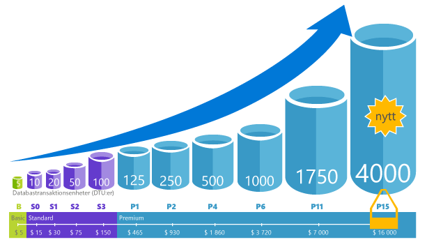
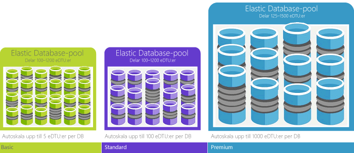

# Vad är hello Azure SQL Database-tjänsten? 

SQL-databasen är en allmän relationsdatabastjänst i Microsoft Azure som har stöd för strukturer som relationsdata, JSON, spatial och XML. Ger [dynamiskt skalbar prestanda](sql-database-service-tiers.md) och innehåller alternativ som [kolumnlagringsindex](https://docs.microsoft.com/sql/relational-databases/indexes/columnstore-indexes-overview) för extremanalys och rapporter, samt [minnesintern OLTP](sql-database-in-memory.md) för extrem transaktionell bearbetning. Microsoft hanterar alla korrigeringar och uppdatering av hello SQL-kodbas sömlöst och avlägsnar bort all hantering av hello underliggande infrastruktur. 

SQL-databas delar dess kodbas med hello [Microsoft SQL Server-databasmotorn](https://docs.microsoft.com/sql/sql-server/sql-server-technical-documentation). Med Microsofts molntjänster första strategi är hello senaste funktionerna i SQL Server utgivna första tooSQL databasen och sedan tooSQL själva servern. Den här metoden ger dig hello senaste SQL Server-funktionerna med utan kostnader för uppdatering eller uppgradering- och med de nya funktionerna testas över miljontals databaser. Mer information om nya funktioner efter hand som de tillkännages finns i:

- **[Azure SQL Database-översikt](https://azure.microsoft.com/roadmap/?category=databases)**: en plats toofind nyheter och vad kommer härnäst. 
- **[Azure SQL Database-blogg](https://azure.microsoft.com/blog/topics/database)**: en plats där SQL Server-produktteamet bloggar om nyheter och funktioner om SQL Database. 

SQL Database levererar förutsägbar prestanda på flera servicenivåer som ger dynamisk skalbarhet utan driftstopp, inbyggd intelligent optimering, global skalbarhet och tillgänglighet samt alternativ för avancerad säkerhet – allt detta med nästan obefintlig administration. Dessa funktioner kan du toofocus på snabb apputveckling och accelerera din tid toomarket i stället allokera värdefull tid och resurser toomanaging virtuella datorer och infrastruktur. hello SQL-databas som tjänsten är för närvarande i 38 data fokuserad på hello world med flera Datacenter kommer online regelbundet, vilket gör att du toorun databasen i ett datacenter nära dig.

> [!NOTE]
> Besök [Azure Säkerhetscenter](https://azure.microsoft.com/support/trust-center/security/) för information om Azures plattformssäkerhet.
>

## Skalbar prestanda och pooler

Med SQL-databas måste alla databaser vara isolerade från varandra och portabla, var och en med sin egen [tjänstnivå](sql-database-service-tiers.md) med en garanterad prestandanivå. SQL-databasen innehåller olika prestandanivåer för olika behov och gör att databaserna toobe grupperade toomaximize hello användning av resurser och spara pengar.

### Justera prestanda och skalning utan avbrott

SQL-databas erbjuder fyra servicenivåer toosupport lightweight tooheavyweight databasarbetsbelastningar: Basic, Standard, Premium och Premium-RS. Du kan skapa din första app på en liten, enskild databas till låg kostnad per månad och ändra dess tjänstnivån manuellt eller automatiskt på alla tid toomeet hello behoven för din lösning. Du kan justera prestanda utan driftavbrott tooyour app eller tooyour kunder. Dynamisk skalbarhet aktiverar databasen-tootransparently svara toorapidly ändra resurskraven och aktiverar du tooonly betalar för hello resurser som du behöver när du behöver dem.

   

### Elastiska pooler toomaximize resursutnyttjande

För många företag och program som kan toocreate enskilda databaser och reglera prestandan uppåt eller nedåt på begäran är tillräckligt, särskilt om användningsmönster är relativt förutsägbara. Men om du har oförutsägbara användningsmönster, kan det vara svårt toomanage kostnader och din affärsmodell. [Elastiska pooler](sql-database-elastic-pool.md) är utformad toosolve problemet. hello konceptet är enkelt. Du allokerar prestanda resurser tooa poolen i stället för en individuell databas och betalar för hello samlade prestandan resurser av hello poolen i stället för för prestandan för enskilda databaser. 

   

Du behöver toofocus på ringer databasprestanda uppåt och nedåt när begäran för resurser fluktuerar med elastiska pooler. hello förbrukar grupperade databaser hello prestanda resurser för hello elastisk pool vid behov. Grupperade databaser förbrukar, men överstiga inte hello gränserna för hello poolen, så att dina kostnader förblir förutsägbara även om enskilda databasanvändningen inte. Vad är mer du kan [lägga till och ta bort databaser toohello poolen](sql-database-elastic-pool-manage-portal.md), skalning av appen från en handfull databaser toothousands inuti en budget som du bestämmer. Du kan också kontroll hello minsta och största resurser tillgängliga toodatabases i hello poolen tooensure att ingen databas i hello pool använder alla hello resurser och att varje pool databas har en garanterad minsta mängd resurser. toolearn mer om designmönster för SaaS-program med elastiska pooler finns [designmönster för SaaS-program för flera innehavare med SQL Database](sql-database-design-patterns-multi-tenancy-saas-applications.md).

### Blanda enskilda databaser med databaser i en pool

Vilken väg du än väljer – enskilda databaser eller elastiska pooler – är du inte låst. Du kan blanda enskilda databaser med elastiska pooler och ändra hello tjänstnivåer för enskilda databaser och elastiska pooler snabbt och enkelt tooadapt tooyour situation. Hello kraft och räckvidd som Azure kan du blanda och matcha-andra Azure-tjänster med SQL Database toomeet appen unika utforma behov, enhet kostnad och effektivitet för resursen och upptäcka nya affärsmöjligheter.

### Omfattande övervakning och aviseringsfunktioner

Men hur kan du jämföra hello relativa prestandan för enskilda databaser och elastiska pooler? Hur vet du hello rätt värden när man reglerar uppåt och nedåt? Du använder hello [inbyggda prestandaövervakning](sql-database-performance.md) och [aviseringar](sql-database-insights-alerts-portal.md) verktyg, kombinerat med hello prestanda baserat på [Database Transaction Units (Dtu) för enskilda databaser och Elastiskt dtu: er (edtu: er) för elastiska pooler](sql-database-what-is-a-dtu.md). Använda dessa verktyg kan du snabbt bedöma hello effekten av att skala upp eller ned baserat på din aktuella eller projektet prestandabehov. Se [SQL Database, alternativ och prestanda: Förstå vad varje tjänstnivå erbjuder](sql-database-service-tiers.md) för mer information.

Dessutom kan SQL-databasen [skapa mått och diagnostikloggar](sql-database-metrics-diag-logging.md) för lättare övervakning. Du kan konfigurera SQL-databas toostore Resursanvändning, personal och sessioner och anslutning till en av dessa Azure-resurser:

- **Azure Storage**: För arkivering av stora mängder telemetri till ett lågt pris
- **Azure Event Hub**: För integrering av telemetri i SQL-databasen med anpassad övervakningslösning eller heta pipelines
- **Azure Log Analytics**: För inbyggda övervakningslösningar med rapporteringer, avisering och problemlösningskapacitet

    

## Kapacitet för tillgänglighet

Azures branschledande serviceavtal [(SLA)](http://azure.microsoft.com/support/legal/sla/) med 99,99 % tillgänglighet, drivs av ett globalt nätverk med Microsoft-hanterade datacenter som gör att din app är igång 24/7. SQL Database tillhandahåller dessutom inbyggda funktioner för [kontinuitet för företag och global skalbarhet](sql-database-business-continuity.md), inklusive:

- **[Automatisk säkerhetskopiering](sql-database-automated-backups.md)**: SQL-databasen utför automatiskt fullständiga och differentiella säkerhetskopieringar samt säkerhetskopiering av transaktionsloggen.
- **[I tidpunkt återställningar](sql-database-recovery-using-backups.md)**: SQL Database stöder tooany återställningspunkt tidpunkt i hello kvarhållningsperiod för automatisk säkerhetskopiering.
- **[Aktiv geo-replikering](sql-database-geo-replication-overview.md)**: SQL-databas kan tooconfigure in toofour läsbara sekundära databaser i antingen hello samma eller ett globalt distribuerat Azure-datacenter.  Till exempel om du har ett SaaS-program med en katalog-databas som har ett stort antal samtidiga transaktioner i skrivskyddat läge, Använd aktiv geo-replikering tooenable globala läsa skala och ta bort flaskhalsar på hello primära som har förfallit till betalning tooread arbetsbelastningar. 
- **[Redundans grupper](sql-database-geo-replication-overview.md)**: SQL-databas kan du tooenable hög tillgänglighet och belastningsutjämning på global nivå, inklusive transparent geo-replikering och redundans för stora mängder databaser och elastiska pooler. Redundans grupper och aktiv geo-replikering aktiverar skapandet av globalt distribuerade SaaS-program med minimal administration omkostnader lämnar alla hello komplexa övervakning, Routning och failover orchestration tooSQL databas.

## Inbyggd intelligens

Med SQL-databas får du inbyggd intelligens som hjälper dig att avsevärt minska hello kostnader för att köra och hantera databaser och maximerar både prestanda och säkerhet för programmet. Arbetsbelastningar som körs miljontals kunden dygnet runt, SQL Database samlar in och bearbetar en omfattande mängd telemetridata, samtidigt som också fullständigt kundens integritet hello bakgrunden. Olika algoritmer utvärderar kontinuerligt hello telemetridata så att hello-tjänsten kan lära sig och anpassa dem med ditt program. Baserat på den här analysen har hello-tjänsten prestanda förbättras rekommendationer skräddarsydd tooyour viss arbetsbelastning. 

### Automatisk prestandajustering

SQL-databasen innehåller detaljerade kunskaper om hello frågar du behöver toomonitor. SQL Database lär sig om din databas och aktiverar du tooadapt din databas schemat tooyour arbetsbelastning. SQL-databasen innehåller rekommendationer för prestandajustering med [SQL Database Advisor](sql-database-advisor.md) där du kan granska prestandajusteringsåtgärder och använda dem. Det kan vara svårt att konstant övervaka databasen, särskilt när vi hanterar flera databaser. Hantera ett stort antal databaser kan vara omöjligt toodo effektivt även med alla tillgängliga verktyg och rapporter med SQL Database och Azure-portalen. I stället för att övervaka och justera databasen manuellt, kan du delegera vissa av hello övervaka och justera åtgärder tooSQL databasen med funktionen för automatisk justering. SQL-databasen automatiskt tillämpa rekommendationer testerna och verifierar var och en av dess prestandajustering åtgärder tooensure hello prestanda håller förbättra. På så sätt kan anpassas SQL-databasen automatiskt tooyour arbetsbelastning i kontrollerade och säkert sätt. Automatisk justering innebär att hello databasens prestanda övervakas noggrant och jämfört med före och efter varje prestandajustering åtgärd, och om inte förbättrar hello prestanda hello justera åtgärden har återställts.

Idag, många av våra samarbetspartner kör [SaaS-appar för flera innehavare](sql-database-design-patterns-multi-tenancy-saas-applications.md) ovanpå SQL-databas är att förlita sig på automatisk prestandajustering toomake till sina program har alltid stabila och förutsägbara prestanda. För dessa minskar den här funktionen oerhört mycket hello risk för att en incident för prestanda i hello mitten av hello natten. Eftersom en del av deras kundbas också använder SQL Server, de dessutom använder hello samma indexering rekommendationer som tillhandahålls av SQL-databas toohelp sina SQL Server-kunder.

Det finns två automatiska justeringsaspekter som är tillgängliga i SQL Database:

- **[Automatisk indexhantering](sql-database-automatic-tuning.md#automatic-index-management)**: Identifierar index som bör läggas till i din databas och index som ska tas bort.
- **[Plan för automatisk korrigering](sql-database-automatic-tuning.md#automatic-plan-choice-correction)**: Identifierar problematiska planer och åtgärdar prestandaproblem i SQL planen (kommer snart, redan finns i SQL Server 2017).

### Anpassningsbar frågebearbetning

Vi också lägger till hello [anpassningsbar frågebearbetning](/sql/relational-databases/performance/adaptive-query-processing) familj av funktioner tooSQL databasen, inklusive överlagrad körning för flera instruktioner tabellvärdesfunktioner, batch-läge minne ge feedback och batch-läge anpassningsbar kopplingar . De olika funktionerna anpassningsbar frågebearbetning gäller liknande ”Läs och anpassa” tekniker hjälper ytterligare adress problem relaterade toohistorically intractable frågan optimering prestandaproblem.

### Intelligent hotidentifiering

 [SQL-Hotidentifiering](sql-database-threat-detection.md) utnyttjar [SQL Database auditing](sql-database-auditing.md) toocontinuously övervaka Azure SQL-databaser för potentiellt skadliga försök tooaccess känsliga data. SQL-hotidentifiering ger ett nytt lager av säkerhet som gör att kunder toodetect och svarar toopotential hot som de sker genom att tillhandahålla säkerhetsaviseringar på avvikande aktiviteter. Användare får aviseringar om misstänkta databasaktiviteter, potentiella svagheter, SQL-filinmatningsattacker och avvikande mönster i databasåtkomst. SQL threat detection aviseringar ger detaljerad information om misstänkt aktivitet och rekommenderar åtgärd på hur tooinvestigate och minimera hotet hello. Användare kan utforska hello misstänkta händelser toodetermine om hello händelse resultat från en försök tooaccess bryta mot eller utnyttja data i hello-databas. Hotidentifiering gör det enkelt tooaddress potentiella hot toohello databas utan hello måste toobe en säkerhetsexpert på eller hantera avancerade säkerhetsövervakning system.

## Avancerad säkerhet och efterlevnad

SQL-databasen innehåller en uppsättning [inbyggda funktioner för säkerhet och efterlevnad](sql-database-security-overview.md) toohelp tillämpningsprogrammet uppfylla olika krav för säkerhet och efterlevnad. 

### Granskning för efterlevnad och säkerhet

[SQL Database Auditing](sql-database-auditing.md) spårar databashändelser och skriver dem tooan granskningslogg i ditt Azure storage-konto. Granskning kan hjälpa dig att upprätthålla regelefterlevnad, förstå databasaktiviteter och få insyn i avvikelser och fel som kan tyda på affärsproblem eller potentiella säkerhetsöverträdelser.

### Datakryptering i vila

SQL-databas [transparent datakryptering](https://docs.microsoft.com/sql/relational-databases/security/encryption/transparent-data-encryption-with-azure-sql-database) hjälper dig att skydda mot hello hotet att skadlig aktivitet genom att utföra realtid kryptering och dekryptering av hello databas, tillhörande säkerhetskopior och transaktionsloggfiler vilande utan ändringar toohello program. Från och med kan 2017 skyddas alla nyligen skapade Azure SQL-databaser automatiskt med transparent datakryptering (TDE). TDE är SQL-beprövad kryptering i vila-teknik som krävs av många efterlevnad standarder tooprotect mot stöld av lagringsmedia. Kunder kan hantera hello TDE krypteringsnycklar och andra hemligheter på ett sätt för skyddade och kompatibla med Azure Key Vault.

### Datakryptering i rörelse

SQL-databasen är hello endast databasen system toooffer skyddet av känsliga data som rör sig i vila och under frågebearbetning med [Always Encrypted](https://docs.microsoft.com/sql/relational-databases/security/encryption/always-encrypted-database-engine). Krypterad finns alltid en branschledande som erbjuder ojämförbar data skydd mot överträdelser som involverar hello stöld av kritiska data. Till exempel med Always Encrypted lagras kunders kreditkortsnummer krypterade i hello databasen alltid, även under bearbetning, att tillåta dekryptering vid hello punkt för användning av behöriga personer eller program som behöver tooprocess data.

### Dynamisk datamaskning

[SQL-databas dynamisk datamaskning](sql-database-dynamic-data-masking-get-started.md) begränsar exponering av känsliga data genom att kombinera den toonon-Privilegierade användare. Dynamisk datamaskning hjälper till att förhindra obehörig åtkomst toosensitive data genom att aktivera kunder toodesignate hur mycket av hello känsliga data tooreveal med minimal påverkan på hello programnivå. Det är en funktion för principbaserad säkerhet som döljer hello känsliga data i hello resultatet av en fråga över avsedda databasfält medan hello data i hello databas inte ändras.

### Säkerhet på radnivå

[Radnivå säkerhet](https://docs.microsoft.com/sql/relational-databases/security/row-level-security) gör att kunder toocontrol åtkomst toorows i en databastabell baserat på hello egenskaper för hello användaren kör en fråga (som med gruppen medlemskap eller köra context). Säkerheten på radnivå (RLS) förenklar hello design och kodning av säkerhet i ditt program. RLS kan tooimplement begränsningar för dataåtkomst för raden. Till exempel att säkerställa att anställda kan komma åt de datarader som är relevanta tootheir avdelning eller begränsa kundens data access tooonly hello data relevanta tootheir företag.

### Azure Active Directory-integrering och multifaktorautentisering

SQL-databasen aktiverar du toocentrally Hantera identiteter för databasanvändare och andra Microsoft-tjänster med [Azure Active Directory-integrering](sql-database-aad-authentication.md). Den här funktionen förenklar hanteringen av behörighet och ger ökad säkerhet. Azure Active Directory stöder [multifaktorautentisering](sql-database-ssms-mfa-authentication.md) (MFA) tooincrease data och program säkerhet när stöder en enda rör-process.

### Efterlevnadscertifiering

SQL Database granskas regelbundet och har certifierats mot flera efterlevnadsstandarder. Mer information finns i hello [Microsoft Azure Trust Center](https://azure.microsoft.com/support/trust-center/), där du kan hitta hello mest aktuella listan över [SQL-databas efterlevnad certifieringar](https://azure.microsoft.com/support/trust-center/services/).

## Lättanvända verktyg

SQL Database gör byggandet och underhållet av appar enklare och mer produktivt. SQL-databas kan du toofocus på vad du gör bäst: skapa bra appar. Du kan hantera och utveckla SQL Database med verktyg och kunskaper som du redan har.

- **[hello Azure-portalen](https://portal.azure.com/)**: ett webbaserat program för att hantera alla Azure-tjänster 
- **[SQL Server Management Studio](https://docs.microsoft.com/sql/ssms/download-sql-server-management-studio-ssms)**: ett kostnadsfritt, nedladdningsbart klientprogram för att hantera alla SQL-infrastruktur från SQL Server-tooSQL databas
- **[SQL Server Data Tools i Visual Studio](https://docs.microsoft.com/sql/ssdt/download-sql-server-data-tools-ssdt)**: ett kostnadsfritt, nedladdningsbart klientprogram för att utveckla relationsdatabaser i SQL Server, Azure SQL-databaser, Integration Services-paket, datamodeller för Analysis Services och Reporting Services-rapporter.
- **[Visual Studio Code](https://code.visualstudio.com/docs)**: ett kostnadsfritt, nedladdningsbart, Öppna källa, redigerare för Windows och macOS Linux som har stöd för tillägg, inklusive hello [mssql tillägget](https://aka.ms/mssql-marketplace) för frågor till Microsoft SQL Server Azure SQL Database och SQL Data Warehouse.

Skapa program med Python, Java, Node.js, PHP, Ruby, och .NET på hello MacOS, Linux och Windows har stöd för SQL-databas. Stöder SQL Database hello samma [anslutningsbibliotek](sql-database-libraries.md) som SQL Server.

## Tala med hello teknikteamet för SQL Server

- [DBA Stack Exchange](https://dba.stackexchange.com/questions/tagged/sql-server): Ställ frågor om databasadministration
- [Stack Overflow](http://stackoverflow.com/questions/tagged/sql-server): Ställ frågor om utveckling
- [MSDN-forum](https://social.msdn.microsoft.com/Forums/en-US/home?category=sqlserver): Ställ tekniska frågor
- [Microsoft Connect](https://connect.microsoft.com/SQLServer/Feedback): Rapportera fel och kom med förslag
- [Reddit](https://www.reddit.com/r/SQLServer/): Diskutera SQL Server

## Nästa steg

- Se hello [sida med priser](https://azure.microsoft.com/pricing/details/sql-database/) för enskilda databaser och elastiska pooler kostnadsjämförelse och Kostnadsberäknare.

- Se dessa quick startar tooget som du startade:

  - [Skapa en SQL-databas i hello Azure-portalen](sql-database-get-started-portal.md)  
  - [Skapa en SQL-databas med hello Azure CLI](sql-database-get-started-cli.md)
  - [Skapa en SQL Database med PowerShell](sql-database-get-started-powershell.md)

- En uppsättning Azure CLI- och PowerShell-exempel finns här:
  - [Azure CLI-exempel för SQL Database](sql-database-cli-samples.md)
  - [Azure PowerShell-exempel för SQL Database](sql-database-powershell-samples.md)
