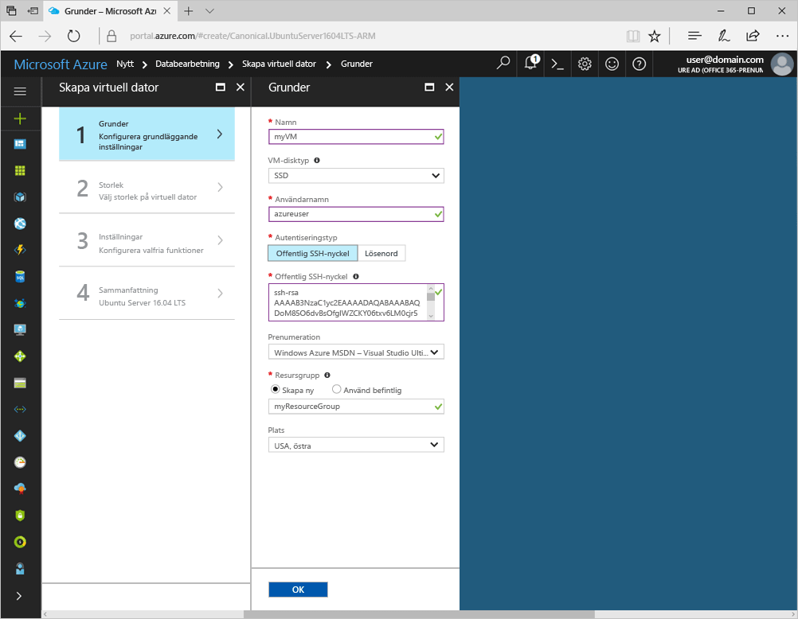
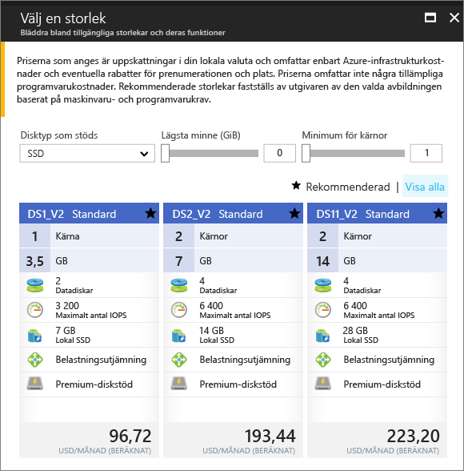

# <a name="create-a-linux-virtual-machine-with-hello-azure-portal"></a>Skapa en virtuell Linux-dator med hello Azure-portalen

Du kan skapa virtuella Azure-datorer via hello Azure-portalen. Den här metoden ger ett webbläsarbaserat användargränssnitt för att skapa och konfigurera virtuella datorer och alla relaterade resurser. Den här snabbstartsguide genom att skapa en virtuell dator och installera en webbserver på hello VM.

Om du inte har en Azure-prenumeration kan du skapa ett [kostnadsfritt konto](https://azure.microsoft.com/free/?WT.mc_id=A261C142F) innan du börjar.

## <a name="create-ssh-key-pair"></a>Skapa SSH-nyckelpar

Du behöver en SSH-nyckelpar toocomplete denna Snabbstart. Om du har ett befintligt SSH-nyckelpar kan du hoppa över det här steget.

Kör kommandot från ett Bash-gränssnitt och följ hello på skärmen anvisningarna. hello kommandoutdata innehåller hello filnamn hello offentlig nyckelfil. Kopiera hello innehållet i hello offentlig nyckelfil toohello Urklipp.

```bash
ssh-keygen -t rsa -b 2048
```

## <a name="log-in-tooazure"></a>Logga in tooAzure 

Logga in toohello Azure-portalen på http://portal.azure.com.

## <a name="create-virtual-machine"></a>Skapa en virtuell dator

1. Klicka på hello **ny** knappen hittades på hello övre vänstra hörnet av hello Azure-portalen.

2. Välj **Compute** och välj sedan **Ubuntu Server 16.04 LTS**. 

3. Ange information om hello virtuella datorn. Välj **Offentlig SSH-nyckel** som **Autentiseringstyp**. När den klistras in i din offentliga SSH-nyckel, ta hand tooremove några inledande eller avslutande blanksteg. När du är klar klickar du på **OK**.

    

4. Välj en storlek för hello VM. toosee flera storlekar, Välj **visa alla** eller ändra hello **stöds disktyp** filter. 

      

5. På inställningsbladet för hello, hålla hello standardvärden och klicka på **OK**.

6. Klicka på sammanfattningssidan hello **Ok** toostart hello distribution av virtuella datorer.

7. hello VM kommer att fästa toohello Azure portalens instrumentpanel. När hello distributionen är klar öppnas automatiskt hello VM sammanfattning bladet.


## <a name="connect-toovirtual-machine"></a>Ansluta toovirtual datorn

Skapa en SSH-anslutning med hello virtuell dator.

1. Klicka på hello **Anslut** hello virtuella bladet-knappen. hello ansluta knappen visar en SSH-anslutningssträngen som används tooconnect toohello virtuell dator.

     

2. Hello kör följande kommando toocreate en SSH-session. Ersätt hello anslutningssträngen med hello som du kopierade från hello Azure-portalen.

```bash 
ssh azureuser@40.112.21.50
```

## <a name="install-nginx"></a>Installera NGINX

Använd hello följande bash skriptet tooupdate paketet källor och installera hello senaste NGINX-paketet. 

```bash 
#!/bin/bash

# update package source
sudo apt-get -y update

# install NGINX
sudo apt-get -y install nginx
```

När du är klar avslutar hello SSH-session och returnerar hello VM-egenskaper i hello Azure-portalen.


## <a name="open-port-80-for-web-traffic"></a>Öppna port 80 för webbtrafik 

En nätverkssäkerhetsgrupp (NSG) säkrar ingående och utgående trafik. När en virtuell dator skapas från hello Azure-portalen, skapas en regel för inkommande trafik på port 22 för SSH-anslutningar. Eftersom den här virtuella datorn är värd för en webbserver, måste en NSG regel toobe som skapats för port 80.

1. Hello virtuell dator, klicka hello namnet på hello **resursgruppen**.
2. Välj hello **nätverkssäkerhetsgruppen**. hello NSG kan identifieras med hello **typen** kolumn. 
3. På hello vänstra menyn under inställningar, **inkommande säkerhetsregler**.
4. Klicka på **Lägg till**.
5. Skriv **http** i fältet **Namn**. Kontrollera att **portintervall** anges too80 och **åtgärd** har angetts för**Tillåt**. 
6. Klicka på **OK**.


## <a name="view-hello-nginx-welcome-page"></a>Visa hello NGINX-välkomstsidan

Med NGINX installerad och port 80 öppna tooyour VM, kan nu komma åt hello webbserver från hello internet. Öppna en webbläsare och ange hello offentliga IP-adress hello VM. hello offentliga IP-adressen finns på hello VM-blad i hello Azure-portalen.

 

## <a name="clean-up-resources"></a>Rensa resurser

Ta bort hello resursgrupp, virtuell dator och alla relaterade resurser när de inte längre behövs. toodo så Välj hello resursgruppen hello virtuella bladet och klicka på **ta bort**.

## <a name="next-steps"></a>Nästa steg

I den här snabbstarten har du distribuerat en virtuell dator och en regel för nätverkssäkerhetsgrupp samt installerat en webbserver. toolearn mer om Azure-datorer, fortsätta toohello självstudier för Linux virtuella datorer.

> [!div class="nextstepaction"]
> [Självstudier om virtuella Azure Linux-datorer](./tutorial-manage-vm.md)
