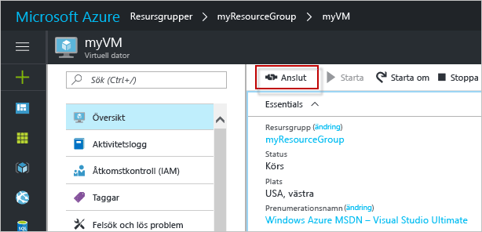

# <a name="create-a-linux-virtual-machine-with-hello-azure-portal"></a><span data-ttu-id="39596-103">Skapa en virtuell Linux-dator med hello Azure-portalen</span><span class="sxs-lookup"><span data-stu-id="39596-103">Create a Linux virtual machine with hello Azure portal</span></span>

<span data-ttu-id="39596-104">Du kan skapa virtuella Azure-datorer via hello Azure-portalen.</span><span class="sxs-lookup"><span data-stu-id="39596-104">Azure virtual machines can be created through hello Azure portal.</span></span> <span data-ttu-id="39596-105">Den här metoden ger ett webbläsarbaserat användargränssnitt för att skapa och konfigurera virtuella datorer och alla relaterade resurser.</span><span class="sxs-lookup"><span data-stu-id="39596-105">This method provides a browser-based user interface for creating and configuring virtual machines and all related resources.</span></span> <span data-ttu-id="39596-106">Den här snabbstartsguide genom att skapa en virtuell dator och installera en webbserver på hello VM.</span><span class="sxs-lookup"><span data-stu-id="39596-106">This Quickstart steps through creating a virtual machine and installing a webserver on hello VM.</span></span>

<span data-ttu-id="39596-107">Om du inte har en Azure-prenumeration kan du skapa ett [kostnadsfritt konto](https://azure.microsoft.com/free/?WT.mc_id=A261C142F) innan du börjar.</span><span class="sxs-lookup"><span data-stu-id="39596-107">If you don't have an Azure subscription, create a [free account](https://azure.microsoft.com/free/?WT.mc_id=A261C142F) before you begin.</span></span>

## <a name="create-ssh-key-pair"></a><span data-ttu-id="39596-108">Skapa SSH-nyckelpar</span><span class="sxs-lookup"><span data-stu-id="39596-108">Create SSH key pair</span></span>

<span data-ttu-id="39596-109">Du behöver en SSH-nyckelpar toocomplete denna Snabbstart.</span><span class="sxs-lookup"><span data-stu-id="39596-109">You need an SSH key pair toocomplete this quick start.</span></span> <span data-ttu-id="39596-110">Om du har ett befintligt SSH-nyckelpar kan du hoppa över det här steget.</span><span class="sxs-lookup"><span data-stu-id="39596-110">If you have an existing SSH key pair, this step can be skipped.</span></span>

<span data-ttu-id="39596-111">Kör kommandot från ett Bash-gränssnitt och följ hello på skärmen anvisningarna.</span><span class="sxs-lookup"><span data-stu-id="39596-111">From a Bash shell, run this command and follow hello on-screen directions.</span></span> <span data-ttu-id="39596-112">hello kommandoutdata innehåller hello filnamn hello offentlig nyckelfil.</span><span class="sxs-lookup"><span data-stu-id="39596-112">hello command output includes hello file name of hello public key file.</span></span> <span data-ttu-id="39596-113">Kopiera hello innehållet i hello offentlig nyckelfil toohello Urklipp.</span><span class="sxs-lookup"><span data-stu-id="39596-113">Copy hello contents of hello public key file toohello clipboard.</span></span>

```bash
ssh-keygen -t rsa -b 2048
```

## <a name="log-in-tooazure"></a><span data-ttu-id="39596-114">Logga in tooAzure</span><span class="sxs-lookup"><span data-stu-id="39596-114">Log in tooAzure</span></span> 

<span data-ttu-id="39596-115">Logga in toohello Azure-portalen på http://portal.azure.com.</span><span class="sxs-lookup"><span data-stu-id="39596-115">Log in toohello Azure portal at http://portal.azure.com.</span></span>

## <a name="create-virtual-machine"></a><span data-ttu-id="39596-116">Skapa en virtuell dator</span><span class="sxs-lookup"><span data-stu-id="39596-116">Create virtual machine</span></span>

1. <span data-ttu-id="39596-117">Klicka på hello **ny** knappen hittades på hello övre vänstra hörnet av hello Azure-portalen.</span><span class="sxs-lookup"><span data-stu-id="39596-117">Click hello **New** button found on hello upper left-hand corner of hello Azure portal.</span></span>

2. <span data-ttu-id="39596-118">Välj **Compute** och välj sedan **Ubuntu Server 16.04 LTS**.</span><span class="sxs-lookup"><span data-stu-id="39596-118">Select **Compute**, and then select **Ubuntu Server 16.04 LTS**.</span></span> 

3. <span data-ttu-id="39596-119">Ange information om hello virtuella datorn.</span><span class="sxs-lookup"><span data-stu-id="39596-119">Enter hello virtual machine information.</span></span> <span data-ttu-id="39596-120">Välj **Offentlig SSH-nyckel** som **Autentiseringstyp**.</span><span class="sxs-lookup"><span data-stu-id="39596-120">For **Authentication type**, select **SSH public key**.</span></span> <span data-ttu-id="39596-121">När den klistras in i din offentliga SSH-nyckel, ta hand tooremove några inledande eller avslutande blanksteg.</span><span class="sxs-lookup"><span data-stu-id="39596-121">When pasting in your SSH public key, take care tooremove any leading or trailing white space.</span></span> <span data-ttu-id="39596-122">När du är klar klickar du på **OK**.</span><span class="sxs-lookup"><span data-stu-id="39596-122">When complete, click **OK**.</span></span>

    

4. <span data-ttu-id="39596-124">Välj en storlek för hello VM.</span><span class="sxs-lookup"><span data-stu-id="39596-124">Select a size for hello VM.</span></span> <span data-ttu-id="39596-125">toosee flera storlekar, Välj **visa alla** eller ändra hello **stöds disktyp** filter.</span><span class="sxs-lookup"><span data-stu-id="39596-125">toosee more sizes, select **View all** or change hello **Supported disk type** filter.</span></span> 

      

5. <span data-ttu-id="39596-127">På inställningsbladet för hello, hålla hello standardvärden och klicka på **OK**.</span><span class="sxs-lookup"><span data-stu-id="39596-127">On hello settings blade, keep hello defaults and click **OK**.</span></span>

6. <span data-ttu-id="39596-128">Klicka på sammanfattningssidan hello **Ok** toostart hello distribution av virtuella datorer.</span><span class="sxs-lookup"><span data-stu-id="39596-128">On hello summary page, click **Ok** toostart hello virtual machine deployment.</span></span>

7. <span data-ttu-id="39596-129">hello VM kommer att fästa toohello Azure portalens instrumentpanel.</span><span class="sxs-lookup"><span data-stu-id="39596-129">hello VM will be pinned toohello Azure portal dashboard.</span></span> <span data-ttu-id="39596-130">När hello distributionen är klar öppnas automatiskt hello VM sammanfattning bladet.</span><span class="sxs-lookup"><span data-stu-id="39596-130">Once hello deployment has completed, hello VM summary blade automatically opens.</span></span>


## <a name="connect-toovirtual-machine"></a><span data-ttu-id="39596-131">Ansluta toovirtual datorn</span><span class="sxs-lookup"><span data-stu-id="39596-131">Connect toovirtual machine</span></span>

<span data-ttu-id="39596-132">Skapa en SSH-anslutning med hello virtuell dator.</span><span class="sxs-lookup"><span data-stu-id="39596-132">Create an SSH connection with hello virtual machine.</span></span>

1. <span data-ttu-id="39596-133">Klicka på hello **Anslut** hello virtuella bladet-knappen.</span><span class="sxs-lookup"><span data-stu-id="39596-133">Click hello **Connect** button on hello virtual machine blade.</span></span> <span data-ttu-id="39596-134">hello ansluta knappen visar en SSH-anslutningssträngen som används tooconnect toohello virtuell dator.</span><span class="sxs-lookup"><span data-stu-id="39596-134">hello connect button displays an SSH connection string that can be used tooconnect toohello virtual machine.</span></span>

     

2. <span data-ttu-id="39596-136">Hello kör följande kommando toocreate en SSH-session.</span><span class="sxs-lookup"><span data-stu-id="39596-136">Run hello following command toocreate an SSH session.</span></span> <span data-ttu-id="39596-137">Ersätt hello anslutningssträngen med hello som du kopierade från hello Azure-portalen.</span><span class="sxs-lookup"><span data-stu-id="39596-137">Replace hello connection string with hello one you copied from hello Azure portal.</span></span>

```bash 
ssh azureuser@40.112.21.50
```

## <a name="install-nginx"></a><span data-ttu-id="39596-138">Installera NGINX</span><span class="sxs-lookup"><span data-stu-id="39596-138">Install NGINX</span></span>

<span data-ttu-id="39596-139">Använd hello följande bash skriptet tooupdate paketet källor och installera hello senaste NGINX-paketet.</span><span class="sxs-lookup"><span data-stu-id="39596-139">Use hello following bash script tooupdate package sources and install hello latest NGINX package.</span></span> 

```bash 
#!/bin/bash

# update package source
sudo apt-get -y update

# install NGINX
sudo apt-get -y install nginx
```

<span data-ttu-id="39596-140">När du är klar avslutar hello SSH-session och returnerar hello VM-egenskaper i hello Azure-portalen.</span><span class="sxs-lookup"><span data-stu-id="39596-140">When done, exit hello SSH session and return hello VM properties in hello Azure portal.</span></span>


## <a name="open-port-80-for-web-traffic"></a><span data-ttu-id="39596-141">Öppna port 80 för webbtrafik</span><span class="sxs-lookup"><span data-stu-id="39596-141">Open port 80 for web traffic</span></span> 

<span data-ttu-id="39596-142">En nätverkssäkerhetsgrupp (NSG) säkrar ingående och utgående trafik.</span><span class="sxs-lookup"><span data-stu-id="39596-142">A Network security group (NSG) secures inbound and outbound traffic.</span></span> <span data-ttu-id="39596-143">När en virtuell dator skapas från hello Azure-portalen, skapas en regel för inkommande trafik på port 22 för SSH-anslutningar.</span><span class="sxs-lookup"><span data-stu-id="39596-143">When a VM is created from hello Azure portal, an inbound rule is created on port 22 for SSH connections.</span></span> <span data-ttu-id="39596-144">Eftersom den här virtuella datorn är värd för en webbserver, måste en NSG regel toobe som skapats för port 80.</span><span class="sxs-lookup"><span data-stu-id="39596-144">Because this VM hosts a webserver, an NSG rule needs toobe created for port 80.</span></span>

1. <span data-ttu-id="39596-145">Hello virtuell dator, klicka hello namnet på hello **resursgruppen**.</span><span class="sxs-lookup"><span data-stu-id="39596-145">On hello virtual machine, click hello name of hello **Resource group**.</span></span>
2. <span data-ttu-id="39596-146">Välj hello **nätverkssäkerhetsgruppen**.</span><span class="sxs-lookup"><span data-stu-id="39596-146">Select hello **network security group**.</span></span> <span data-ttu-id="39596-147">hello NSG kan identifieras med hello **typen** kolumn.</span><span class="sxs-lookup"><span data-stu-id="39596-147">hello NSG can be identified using hello **Type** column.</span></span> 
3. <span data-ttu-id="39596-148">På hello vänstra menyn under inställningar, **inkommande säkerhetsregler**.</span><span class="sxs-lookup"><span data-stu-id="39596-148">On hello left-hand menu, under settings, click **Inbound security rules**.</span></span>
4. <span data-ttu-id="39596-149">Klicka på **Lägg till**.</span><span class="sxs-lookup"><span data-stu-id="39596-149">Click on **Add**.</span></span>
5. <span data-ttu-id="39596-150">Skriv **http** i fältet **Namn**.</span><span class="sxs-lookup"><span data-stu-id="39596-150">In **Name**, type **http**.</span></span> <span data-ttu-id="39596-151">Kontrollera att **portintervall** anges too80 och **åtgärd** har angetts för**Tillåt**.</span><span class="sxs-lookup"><span data-stu-id="39596-151">Make sure **Port range** is set too80 and **Action** is set too**Allow**.</span></span> 
6. <span data-ttu-id="39596-152">Klicka på **OK**.</span><span class="sxs-lookup"><span data-stu-id="39596-152">Click **OK**.</span></span>


## <a name="view-hello-nginx-welcome-page"></a><span data-ttu-id="39596-153">Visa hello NGINX-välkomstsidan</span><span class="sxs-lookup"><span data-stu-id="39596-153">View hello NGINX welcome page</span></span>

<span data-ttu-id="39596-154">Med NGINX installerad och port 80 öppna tooyour VM, kan nu komma åt hello webbserver från hello internet.</span><span class="sxs-lookup"><span data-stu-id="39596-154">With NGINX installed, and port 80 open tooyour VM, hello webserver can now be accessed from hello internet.</span></span> <span data-ttu-id="39596-155">Öppna en webbläsare och ange hello offentliga IP-adress hello VM.</span><span class="sxs-lookup"><span data-stu-id="39596-155">Open a web browser, and enter hello public IP address of hello VM.</span></span> <span data-ttu-id="39596-156">hello offentliga IP-adressen finns på hello VM-blad i hello Azure-portalen.</span><span class="sxs-lookup"><span data-stu-id="39596-156">hello public IP address can be found on hello VM blade in hello Azure portal.</span></span>

 

## <a name="clean-up-resources"></a><span data-ttu-id="39596-158">Rensa resurser</span><span class="sxs-lookup"><span data-stu-id="39596-158">Clean up resources</span></span>

<span data-ttu-id="39596-159">Ta bort hello resursgrupp, virtuell dator och alla relaterade resurser när de inte längre behövs.</span><span class="sxs-lookup"><span data-stu-id="39596-159">When no longer needed, delete hello resource group, virtual machine, and all related resources.</span></span> <span data-ttu-id="39596-160">toodo så Välj hello resursgruppen hello virtuella bladet och klicka på **ta bort**.</span><span class="sxs-lookup"><span data-stu-id="39596-160">toodo so, select hello resource group from hello virtual machine blade and click **Delete**.</span></span>

## <a name="next-steps"></a><span data-ttu-id="39596-161">Nästa steg</span><span class="sxs-lookup"><span data-stu-id="39596-161">Next steps</span></span>

<span data-ttu-id="39596-162">I den här snabbstarten har du distribuerat en virtuell dator och en regel för nätverkssäkerhetsgrupp samt installerat en webbserver.</span><span class="sxs-lookup"><span data-stu-id="39596-162">In this quick start, you’ve deployed a simple virtual machine, a network security group rule, and installed a web server.</span></span> <span data-ttu-id="39596-163">toolearn mer om Azure-datorer, fortsätta toohello självstudier för Linux virtuella datorer.</span><span class="sxs-lookup"><span data-stu-id="39596-163">toolearn more about Azure virtual machines, continue toohello tutorial for Linux VMs.</span></span>

> [!div class="nextstepaction"]
> [<span data-ttu-id="39596-164">Självstudier om virtuella Azure Linux-datorer</span><span class="sxs-lookup"><span data-stu-id="39596-164">Azure Linux virtual machine tutorials</span></span>](./tutorial-manage-vm.md)
