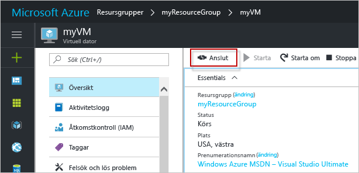

# <a name="create-a-windows-virtual-machine-with-hello-azure-portal"></a><span data-ttu-id="fe163-103">Skapa en virtuell Windows-dator med hello Azure-portalen</span><span class="sxs-lookup"><span data-stu-id="fe163-103">Create a Windows virtual machine with hello Azure portal</span></span>

<span data-ttu-id="fe163-104">Du kan skapa virtuella Azure-datorer via hello Azure-portalen.</span><span class="sxs-lookup"><span data-stu-id="fe163-104">Azure virtual machines can be created through hello Azure portal.</span></span> <span data-ttu-id="fe163-105">Den här metoden ger ett webbläsarbaserat användargränssnitt för att skapa och konfigurera virtuella datorer och alla relaterade resurser.</span><span class="sxs-lookup"><span data-stu-id="fe163-105">This method provides a browser-based user interface for creating and configuring virtual machines and all related resources.</span></span> <span data-ttu-id="fe163-106">Den här snabbstartsguide genom att skapa en virtuell dator och installera en webbserver på hello VM.</span><span class="sxs-lookup"><span data-stu-id="fe163-106">This Quickstart steps through creating a virtual machine and installing a webserver on hello VM.</span></span>

<span data-ttu-id="fe163-107">Om du inte har en Azure-prenumeration kan du skapa ett [kostnadsfritt konto](https://azure.microsoft.com/free/?WT.mc_id=A261C142F) innan du börjar.</span><span class="sxs-lookup"><span data-stu-id="fe163-107">If you don't have an Azure subscription, create a [free account](https://azure.microsoft.com/free/?WT.mc_id=A261C142F) before you begin.</span></span>

## <a name="log-in-tooazure"></a><span data-ttu-id="fe163-108">Logga in tooAzure</span><span class="sxs-lookup"><span data-stu-id="fe163-108">Log in tooAzure</span></span>

<span data-ttu-id="fe163-109">Logga in toohello Azure-portalen på http://portal.azure.com.</span><span class="sxs-lookup"><span data-stu-id="fe163-109">Log in toohello Azure portal at http://portal.azure.com.</span></span>

## <a name="create-virtual-machine"></a><span data-ttu-id="fe163-110">Skapa en virtuell dator</span><span class="sxs-lookup"><span data-stu-id="fe163-110">Create virtual machine</span></span>

1. <span data-ttu-id="fe163-111">Klicka på hello **ny** knappen hittades på hello övre vänstra hörnet av hello Azure-portalen.</span><span class="sxs-lookup"><span data-stu-id="fe163-111">Click hello **New** button found on hello upper left-hand corner of hello Azure portal.</span></span>

2. <span data-ttu-id="fe163-112">Välj **Compute**, och välj sedan **Windows Server 2016 Datacenter**.</span><span class="sxs-lookup"><span data-stu-id="fe163-112">Select **Compute**, and then select **Windows Server 2016 Datacenter**.</span></span> 

3. <span data-ttu-id="fe163-113">Ange information om hello virtuella datorn.</span><span class="sxs-lookup"><span data-stu-id="fe163-113">Enter hello virtual machine information.</span></span> <span data-ttu-id="fe163-114">hello-användarnamn och lösenord som anges här är används toolog i toohello virtuella datorn.</span><span class="sxs-lookup"><span data-stu-id="fe163-114">hello user name and password entered here is used toolog in toohello virtual machine.</span></span> <span data-ttu-id="fe163-115">När du är klar klickar du på **OK**.</span><span class="sxs-lookup"><span data-stu-id="fe163-115">When complete, click **OK**.</span></span>

      

4. <span data-ttu-id="fe163-117">Välj en storlek för hello VM.</span><span class="sxs-lookup"><span data-stu-id="fe163-117">Select a size for hello VM.</span></span> <span data-ttu-id="fe163-118">toosee flera storlekar, Välj **visa alla** eller ändra hello **stöds disktyp** filter.</span><span class="sxs-lookup"><span data-stu-id="fe163-118">toosee more sizes, select **View all** or change hello **Supported disk type** filter.</span></span> 

      

5. <span data-ttu-id="fe163-120">På inställningsbladet för hello, hålla hello standardvärden och klicka på **OK**.</span><span class="sxs-lookup"><span data-stu-id="fe163-120">On hello settings blade, keep hello defaults and click **OK**.</span></span>

6. <span data-ttu-id="fe163-121">Klicka på sammanfattningssidan hello **Ok** toostart hello distribution av virtuella datorer.</span><span class="sxs-lookup"><span data-stu-id="fe163-121">On hello summary page, click **Ok** toostart hello virtual machine deployment.</span></span>

7. <span data-ttu-id="fe163-122">hello VM kommer att fästa toohello Azure portalens instrumentpanel.</span><span class="sxs-lookup"><span data-stu-id="fe163-122">hello VM will be pinned toohello Azure portal dashboard.</span></span> <span data-ttu-id="fe163-123">När hello distributionen är klar öppnas automatiskt hello VM sammanfattning bladet.</span><span class="sxs-lookup"><span data-stu-id="fe163-123">Once hello deployment has completed, hello VM summary blade automatically opens.</span></span>


## <a name="connect-toovirtual-machine"></a><span data-ttu-id="fe163-124">Ansluta toovirtual datorn</span><span class="sxs-lookup"><span data-stu-id="fe163-124">Connect toovirtual machine</span></span>

<span data-ttu-id="fe163-125">Skapa en anslutning till fjärrskrivbord toohello virtuell dator.</span><span class="sxs-lookup"><span data-stu-id="fe163-125">Create a remote desktop connection toohello virtual machine.</span></span>

1. <span data-ttu-id="fe163-126">Klicka på hello **Anslut** knappen hello egenskaper för virtuell dator.</span><span class="sxs-lookup"><span data-stu-id="fe163-126">Click hello **Connect** button on hello virtual machine properties.</span></span> <span data-ttu-id="fe163-127">En protokollfil för fjärrskrivbord (.rdp-fil) skapas och hämtas.</span><span class="sxs-lookup"><span data-stu-id="fe163-127">A Remote Desktop Protocol file (.rdp file) is created and downloaded.</span></span>

     

2. <span data-ttu-id="fe163-129">tooconnect tooyour VM, öppna hello ned RDP-filen.</span><span class="sxs-lookup"><span data-stu-id="fe163-129">tooconnect tooyour VM, open hello downloaded RDP file.</span></span> <span data-ttu-id="fe163-130">Om du uppmanas till detta klickar du på **Anslut**.</span><span class="sxs-lookup"><span data-stu-id="fe163-130">If prompted, click **Connect**.</span></span> <span data-ttu-id="fe163-131">På en Mac, behöver du en RDP-klient som den här [fjärrskrivbordsklient](https://itunes.apple.com/us/app/microsoft-remote-desktop/id715768417?mt=12) från hello Mac App Store.</span><span class="sxs-lookup"><span data-stu-id="fe163-131">On a Mac, you need an RDP client such as this [Remote Desktop Client](https://itunes.apple.com/us/app/microsoft-remote-desktop/id715768417?mt=12) from hello Mac App Store.</span></span>

3. <span data-ttu-id="fe163-132">Ange hello användarnamn och lösenord som du angav när du skapar hello virtuella datorn och klicka sedan på **Ok**.</span><span class="sxs-lookup"><span data-stu-id="fe163-132">Enter hello user name and password you specified when creating hello virtual machine, then click **Ok**.</span></span>

4. <span data-ttu-id="fe163-133">Du kan få en certifikatvarning under hello inloggningsprocessen.</span><span class="sxs-lookup"><span data-stu-id="fe163-133">You may receive a certificate warning during hello sign-in process.</span></span> <span data-ttu-id="fe163-134">Klicka på **Ja** eller **Fortsätt** tooproceed med hello-anslutning.</span><span class="sxs-lookup"><span data-stu-id="fe163-134">Click **Yes** or **Continue** tooproceed with hello connection.</span></span>


## <a name="install-iis-using-powershell"></a><span data-ttu-id="fe163-135">Installera IIS med PowerShell</span><span class="sxs-lookup"><span data-stu-id="fe163-135">Install IIS using PowerShell</span></span>

<span data-ttu-id="fe163-136">Starta PowerShell-session på hello virtuella datorn och kör följande kommando tooinstall IIS hello.</span><span class="sxs-lookup"><span data-stu-id="fe163-136">On hello virtual machine, start a PowerShell session and run hello following command tooinstall IIS.</span></span>

```powershell
Install-WindowsFeature -name Web-Server -IncludeManagementTools
```

<span data-ttu-id="fe163-137">När du är klar avslutar hello RDP-session och returnerar hello VM-egenskaper i hello Azure-portalen.</span><span class="sxs-lookup"><span data-stu-id="fe163-137">When done, exit hello RDP session and return hello VM properties in hello Azure portal.</span></span>

## <a name="open-port-80-for-web-traffic"></a><span data-ttu-id="fe163-138">Öppna port 80 för webbtrafik</span><span class="sxs-lookup"><span data-stu-id="fe163-138">Open port 80 for web traffic</span></span> 

<span data-ttu-id="fe163-139">En nätverkssäkerhetsgrupp (NSG) säkrar ingående och utgående trafik.</span><span class="sxs-lookup"><span data-stu-id="fe163-139">A Network security group (NSG) secures inbound and outbound traffic.</span></span> <span data-ttu-id="fe163-140">När en virtuell dator skapas från hello Azure-portalen, skapas en regel för inkommande trafik på port 3389 för RDP-anslutningar.</span><span class="sxs-lookup"><span data-stu-id="fe163-140">When a VM is created from hello Azure portal, an inbound rule is created on port 3389 for RDP connections.</span></span> <span data-ttu-id="fe163-141">Eftersom den här virtuella datorn är värd för en webbserver, måste en NSG regel toobe som skapats för port 80.</span><span class="sxs-lookup"><span data-stu-id="fe163-141">Because this VM hosts a webserver, an NSG rule needs toobe created for port 80.</span></span>

1. <span data-ttu-id="fe163-142">Hello virtuell dator, klicka hello namnet på hello **resursgruppen**.</span><span class="sxs-lookup"><span data-stu-id="fe163-142">On hello virtual machine, click hello name of hello **Resource group**.</span></span>
2. <span data-ttu-id="fe163-143">Välj hello **nätverkssäkerhetsgruppen**.</span><span class="sxs-lookup"><span data-stu-id="fe163-143">Select hello **network security group**.</span></span> <span data-ttu-id="fe163-144">hello NSG kan identifieras med hello **typen** kolumn.</span><span class="sxs-lookup"><span data-stu-id="fe163-144">hello NSG can be identified using hello **Type** column.</span></span> 
3. <span data-ttu-id="fe163-145">På hello vänstra menyn under inställningar, **inkommande säkerhetsregler**.</span><span class="sxs-lookup"><span data-stu-id="fe163-145">On hello left-hand menu, under settings, click **Inbound security rules**.</span></span>
4. <span data-ttu-id="fe163-146">Klicka på **Lägg till**.</span><span class="sxs-lookup"><span data-stu-id="fe163-146">Click on **Add**.</span></span>
5. <span data-ttu-id="fe163-147">Skriv **http** i fältet **Namn**.</span><span class="sxs-lookup"><span data-stu-id="fe163-147">In **Name**, type **http**.</span></span> <span data-ttu-id="fe163-148">Kontrollera att **portintervall** anges too80 och **åtgärd** har angetts för**Tillåt**.</span><span class="sxs-lookup"><span data-stu-id="fe163-148">Make sure **Port range** is set too80 and **Action** is set too**Allow**.</span></span> 
6. <span data-ttu-id="fe163-149">Klicka på **OK**.</span><span class="sxs-lookup"><span data-stu-id="fe163-149">Click **OK**.</span></span>


## <a name="view-hello-iis-welcome-page"></a><span data-ttu-id="fe163-150">Visa hello välkomstsidan för IIS</span><span class="sxs-lookup"><span data-stu-id="fe163-150">View hello IIS welcome page</span></span>

<span data-ttu-id="fe163-151">Med IIS installerat och port 80 öppna tooyour VM, kan nu komma åt hello webbserver från hello internet.</span><span class="sxs-lookup"><span data-stu-id="fe163-151">With IIS installed, and port 80 open tooyour VM, hello webserver can now be accessed from hello internet.</span></span> <span data-ttu-id="fe163-152">Öppna en webbläsare och ange hello offentliga IP-adress hello VM.</span><span class="sxs-lookup"><span data-stu-id="fe163-152">Open a web browser, and enter hello public IP address of hello VM.</span></span> <span data-ttu-id="fe163-153">hello offentliga IP-adressen finns på hello VM-blad i hello Azure-portalen.</span><span class="sxs-lookup"><span data-stu-id="fe163-153">hello public IP address can be found on hello VM blade in hello Azure portal.</span></span>

 

## <a name="clean-up-resources"></a><span data-ttu-id="fe163-155">Rensa resurser</span><span class="sxs-lookup"><span data-stu-id="fe163-155">Clean up resources</span></span>

<span data-ttu-id="fe163-156">Ta bort hello resursgrupp, virtuell dator och alla relaterade resurser när de inte längre behövs.</span><span class="sxs-lookup"><span data-stu-id="fe163-156">When no longer needed, delete hello resource group, virtual machine, and all related resources.</span></span> <span data-ttu-id="fe163-157">toodo så Välj hello resursgruppen hello virtuella bladet och klicka på **ta bort**.</span><span class="sxs-lookup"><span data-stu-id="fe163-157">toodo so, select hello resource group from hello virtual machine blade and click **Delete**.</span></span>

## <a name="next-steps"></a><span data-ttu-id="fe163-158">Nästa steg</span><span class="sxs-lookup"><span data-stu-id="fe163-158">Next steps</span></span>

<span data-ttu-id="fe163-159">I den här snabbstarten har du distribuerat en virtuell dator och en regel för nätverkssäkerhetsgrupp samt installerat en webbserver.</span><span class="sxs-lookup"><span data-stu-id="fe163-159">In this quick start, you’ve deployed a simple virtual machine, a network security group rule, and installed a web server.</span></span> <span data-ttu-id="fe163-160">toolearn mer om Azure-datorer, fortsätta toohello självstudier för virtuella Windows-datorer.</span><span class="sxs-lookup"><span data-stu-id="fe163-160">toolearn more about Azure virtual machines, continue toohello tutorial for Windows VMs.</span></span>

> [!div class="nextstepaction"]
> [<span data-ttu-id="fe163-161">Självstudier om virtuella Azure Windows-datorer</span><span class="sxs-lookup"><span data-stu-id="fe163-161">Azure Windows virtual machine tutorials</span></span>](./tutorial-manage-vm.md)
