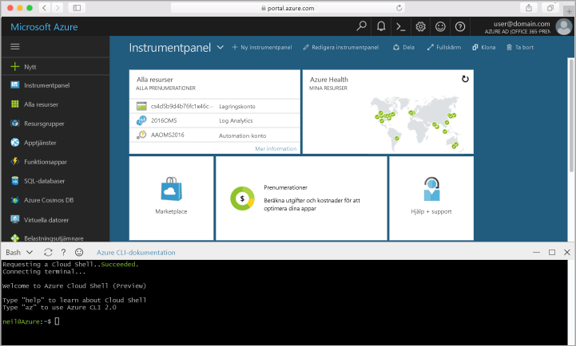

## Starta Azure Cloud Shell

hello Azure Cloud-gränssnittet är ett kostnadsfritt Bash-gränssnitt som du kan köra direkt i hello Azure-portalen. Den har hello Azure CLI förinstallerat och konfigurerats toouse med ditt konto. Klicka på hello **moln Shell** hello-menyn i hello övre högra av hello-knappen [Azure-portalen](https://portal.azure.com).

hello-knappen startar en interaktiv shell som du kan använda toorun alla hello stegen i det här avsnittet:

