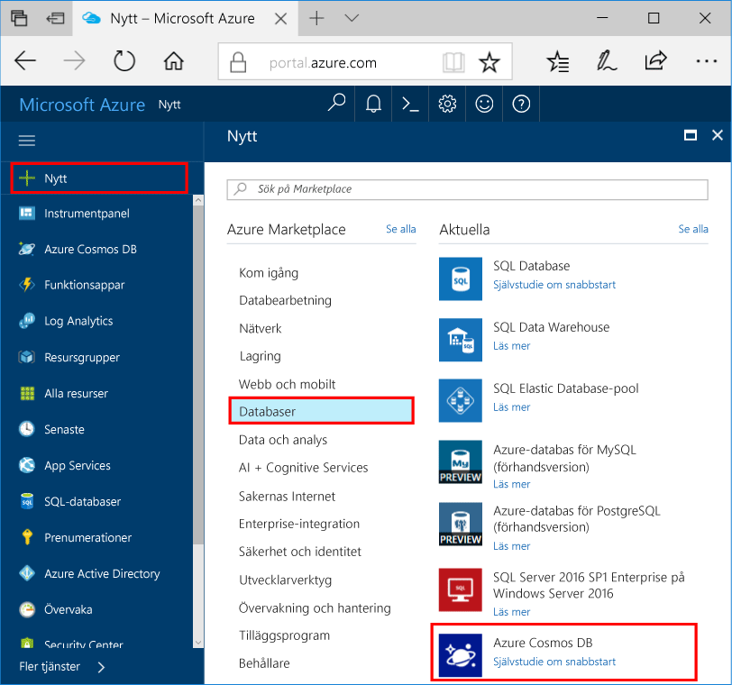
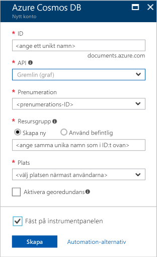

1. Ett nytt fönster och logga in toohello [Azure-portalen](https://portal.azure.com/).In a new window, sign in toohello [Azure portal](https://portal.azure.com/).
2. Hello vänster klickar du på **ny**, klickar du på **databaser**, och sedan under **Azure Cosmos DB**, klickar du på **skapa**.In hello left pane, click **New**, click **Databases**, and then under **Azure Cosmos DB**, click **Create**.
   
   

3. I hello **nytt konto** bladet anger hello-konfiguration som du vill använda för det här kontot i Azure Cosmos DB.In hello **New account** blade, specify hello configuration that you want for this Azure Cosmos DB account. 

    Med Azure Cosmos DB kan du välja någon av fyra programmeringsmodeller: Gremlin (graf), MongoDB, SQL (DocumentDB) och Tabell (nyckelvärde), som var och en kräver ett separat konto.With Azure Cosmos DB, you can choose one of four programming models: Gremlin (graph), MongoDB, SQL (DocumentDB), and Table (key-value), each which currently require a separate account.
       
    I den här artikeln Snabbkurs, vi programmerar mot hello Graph API, så Välj **Gremlin (diagram)** som du anger i hello formulär.In this quick-start article, we program against hello Graph API, so choose **Gremlin (graph)** as you fill out hello form. Om du har dokumentdata från en katalogapp, nyckelvärdedata (tabell) eller data som har migrerats från en MongoDB-app ska du tänka på att Azure Cosmos DB kan tillhandahålla en mycket tillgänglig, globalt distribuerad databastjänstplattform för alla dina verksamhetskritiska program.If you have document data from a catalog app, key/value (table) data, or data that's migrated from a MongoDB app, realize that Azure Cosmos DB can provide a highly available, globally distributed database service platform for all your mission-critical applications.

    Hello fält på hello **nytt konto** bladet med hello information i hello följande skärmbild som guide - värdena kan skilja sig hello värden i hello skärmbild.Complete hello fields on hello **New account** blade, using hello information in hello following screenshot as a guide - your values may be different than hello values in hello screenshot.
 
    

    InställningSetting|Föreslaget värdeSuggested value|BeskrivningDescription
    ---|---|---
    IDID|*Unikt värde**Unique value*|Ett unikt namn du väljer för att identifiera Azure Cosmos DB-kontot.A unique name that identifies this Azure Cosmos DB account. Eftersom *documents.azure.com* är tillagda toohello ID som du anger toocreate URI: N, Använd en unik men identifierbar-ID.Because *documents.azure.com* is appended toohello ID that you provide toocreate your URI, use a unique but identifiable ID. hello-ID måste innehålla endast små bokstäver, siffror och hello bindestreck (-) och det måste innehålla från 3 too50 tecken.hello ID must contain only lowercase letters, numbers, and hello hyphen (-) character, and it must contain from 3 too50 characters.
    APIAPI|Gremlin (graf)Gremlin (graph)|Vi programmerar mot hello [Graph API](../articles/cosmos-db/graph-introduction.md) senare i den här artikeln.We program against hello [Graph API](../articles/cosmos-db/graph-introduction.md) later in this article.|
    PrenumerationSubscription|*Din prenumeration**Your subscription*|hello Azure-prenumeration som du vill toouse för det här kontot i Azure Cosmos DB.hello Azure subscription that you want toouse for this Azure Cosmos DB account. 
    ResursgruppResource Group|*hello samma värde som ID**hello same value as ID*|hello namn på ny resursgrupp för ditt konto.hello new resource group name for your account. För enkelhetens skull kan du använda hello samma namn som ditt ID.For simplicity, you can use hello same name as your ID. 
    PlatsLocation|*hello region närmaste tooyour användare**hello region closest tooyour users*|Hej geografisk plats i vilka toohost Azure DB som Cosmos-konto.hello geographic location in which toohost your Azure Cosmos DB account. Välj hello plats närmaste tooyour användare toogive dem hello snabbast åtkomst toohello data.Choose hello location closest tooyour users toogive them hello fastest access toohello data.

4. Klicka på **skapa** toocreate hello-konto.Click **Create** toocreate hello account.
5. Hello på hello översta verktygsfältet **meddelanden** ikonen  toomonitor hello distributionsprocessen.On hello top toolbar, click hello **Notifications** icon  toomonitor hello deployment process.

    

6.  När hello meddelanden visar hello distribution har slutförts, Stäng hello meddelandefönstret och öppna hello nytt konto från hello **alla resurser** panelen på hello instrumentpanelen.When hello Notifications window indicates hello deployment succeeded, close hello notification window and open hello new account from hello **All Resources** tile on hello Dashboard. 

    
