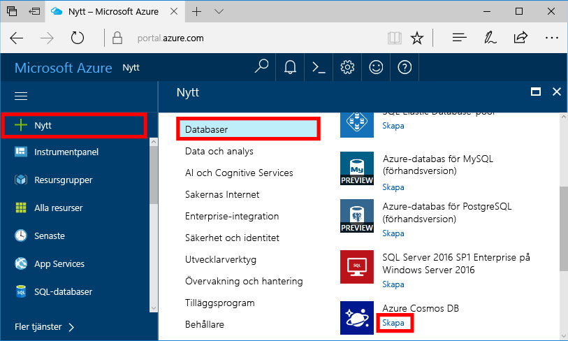
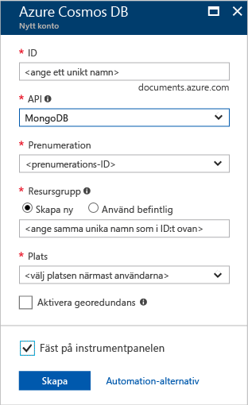
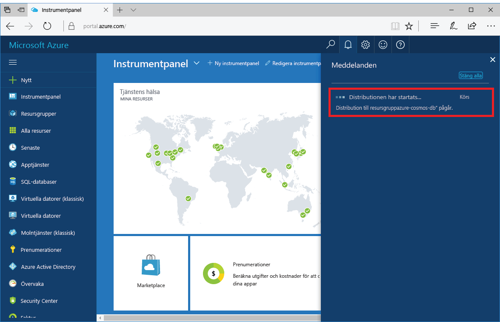
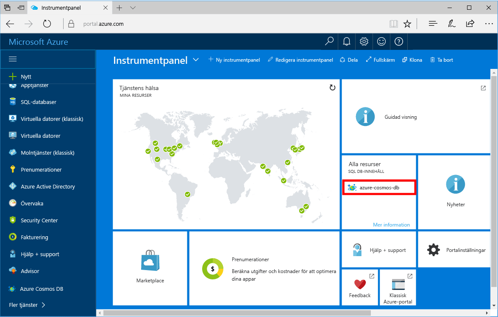

1. Ett nytt fönster och logga in toohello [Azure-portalen](https://portal.azure.com/).In a new window, sign in toohello [Azure portal](https://portal.azure.com/).
2. Hello vänstra menyn klickar du på **ny**, klickar du på **databaser**, och sedan under **Azure Cosmos DB**, klickar du på **skapa**.In hello left menu, click **New**, click **Databases**, and then under **Azure Cosmos DB**, click **Create**.
   
   

3. I hello **nytt konto** bladet anger hello önskad konfiguration för hello Azure DB som Cosmos-konto.In hello **New account** blade, specify hello desired configuration for hello Azure Cosmos DB account. 

    Med Azure Cosmos DB kan du välja någon av fyra programmeringsmodeller: Gremlin (graf), MongoDB, SQL (DocumentDB) och Tabell (nyckelvärde).With Azure Cosmos DB, you can choose one of four programming models: Gremlin (graph), MongoDB, SQL (DocumentDB), and Table (key-value). 
       
    I den här snabbstartsguide vi kommer att programmera mot hello MongoDB API så att du ska välja **MongoDB** som du anger i hello formulär.In this quick start we'll be programming against hello MongoDB API so you'll choose **MongoDB** as you fill out hello form. Men om du har grafdata för en app för sociala medier, dokumentdata från en katalogapp eller nyckelvärdedata (tabell) ska du tänka på att Azure Cosmos DB kan tillhandahålla en mycket tillgänglig, globalt distribuerad databastjänstplattform för alla dina verksamhetskritiska program.But if you have graph data for a social media app, document data from a catalog app, or key/value (table) data, realize that Azure Cosmos DB can provide a highly available, globally-distributed database service platform for all your mission-critical applications.

    Fyll i hello **nytt konto** blad med hjälp av hello information i hello tabellen som en vägledning.Fill out hello **New account** blade using hello information in hello table as a guide.
 
    
   
    InställningSetting|Föreslaget värdeSuggested value|BeskrivningDescription
    ---|---|---
    IDID|*Unikt värde**Unique value*|Ett unikt namn du tooidentify hello Azure DB som Cosmos-konto.A unique name you choose tooidentify hello Azure Cosmos DB account. *Documents.Azure.com* är tillagda toohello-ID du ange toocreate din URI, så Använd ett unikt men identifierbar-ID.*documents.azure.com* is appended toohello ID you provide toocreate your URI, so use a unique but identifiable ID. hello-ID: T kan innehålla endast små bokstäver, siffror och hello '-' tecken och måste vara mellan 3 och 50 tecken.hello ID may contain only lowercase letters, numbers, and hello '-' character, and must be between 3 and 50 characters.
    APIAPI|MongoDBMongoDB|Vi kommer att programmera mot hello [MongoDB API](../articles/documentdb/documentdb-protocol-mongodb.md) senare i den här artikeln.We'll be programming against hello [MongoDB API](../articles/documentdb/documentdb-protocol-mongodb.md) later in this article.|
    PrenumerationSubscription|*Din prenumeration**Your subscription*|hello Azure-prenumeration som du vill toouse för hello Azure DB som Cosmos-kontot.hello Azure subscription that you want toouse for hello Azure Cosmos DB account. 
    ResursgruppResource Group|*hello samma värde som ID**hello same value as ID*|hello namn på ny resursgrupp för ditt konto.hello new resource group name for your account. För enkelhetens skull kan du använda hello samma namn som ditt ID.For simplicity, you can use hello same name as your ID. 
    PlatsLocation|*hello region närmaste tooyour användare**hello region closest tooyour users*|Hej geografisk plats i vilka toohost Azure DB som Cosmos-konto.hello geographic location in which toohost your Azure Cosmos DB account. Välj hello plats närmaste tooyour användare toogive dem hello snabbast åtkomst toohello data.Choose hello location closest tooyour users toogive them hello fastest access toohello data.

4. Klicka på **skapa** toocreate hello-konto.Click **Create** toocreate hello account.
5. På verktygsfältet hello **meddelanden** toomonitor hello distributionsprocessen.On hello toolbar, click **Notifications** toomonitor hello deployment process.

    

6.  När hello distributionen är klar, öppna hello nytt konto från hello alla resurser panelen.When hello deployment is complete, open hello new account from hello All Resources tile. 

    
