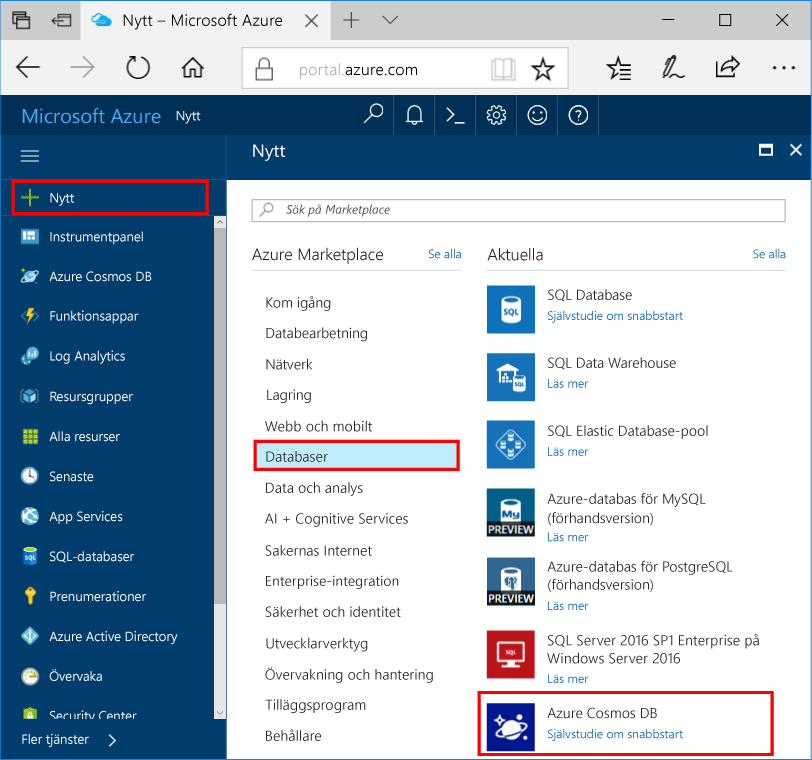

1. Ett nytt fönster och logga in toohello [Azure-portalen](https://portal.azure.com/).
2. Hello vänstra menyn klickar du på **ny**, klickar du på **databaser**, och sedan under **Azure Cosmos DB**, klickar du på **skapa**.
   
   

3. I hello **nytt konto** bladet anger hello önskad konfiguration för hello Azure DB som Cosmos-konto. 

    Med Azure Cosmos DB kan du välja någon av fyra programmeringsmodeller: Gremlin (graf), MongoDB, SQL (DocumentDB) och Tabell (nyckelvärde). 
    
    I den här snabbstartsguide vi kommer att programmera mot hello tabell API så att du ska välja **tabellen (nyckelvärde)** som du anger i hello formulär. Men om du har grafdata för en app för sociala medier, dokumentdata från en katalogapp eller data som har migrerats från en MongoDB-app ska du tänka på att Azure Cosmos DB kan tillhandahålla en mycket tillgänglig, globalt distribuerad databastjänstplattform för alla dina verksamhetskritiska program.

    Fyll i hello nya kontoblad med hello information i hello skärmbilden som vägledning. Du ska välja unika värden som du konfigurerar ditt konto så att värdena inte matchar hello skärmbild exakt. 
 
    

    Inställning|Föreslaget värde|Beskrivning
    ---|---|---
    ID|*Unikt värde*|Ett unikt namn du tooidentify hello Azure DB som Cosmos-konto. *Documents.Azure.com* är tillagda toohello-ID du ange toocreate din URI, så Använd ett unikt men identifierbar-ID. hello-ID: T kan innehålla endast små bokstäver, siffror och hello '-' tecken och måste vara mellan 3 och 50 tecken.
    API|Tabell (nyckelvärde)|Vi kommer att programmera mot hello [tabell API](../articles/cosmos-db/table-introduction.md) senare i den här artikeln.|
    Prenumeration|*Din prenumeration*|hello Azure-prenumeration som du vill toouse för hello Azure DB som Cosmos-kontot. 
    Resursgrupp|*hello samma värde som ID*|hello namn på ny resursgrupp för ditt konto. För enkelhetens skull kan du använda hello samma namn som ditt ID. 
    Plats|*hello region närmaste tooyour användare*|Hej geografisk plats i vilka toohost Azure DB som Cosmos-konto. Välj hello plats närmaste tooyour användare toogive dem hello snabbast åtkomst toohello data.   

4. Klicka på **skapa** toocreate hello-konto.
5. På verktygsfältet hello **meddelanden** toomonitor hello distributionsprocessen.

    

6.  När hello distributionen är klar, öppna hello nytt konto från hello alla resurser panelen. 

    
