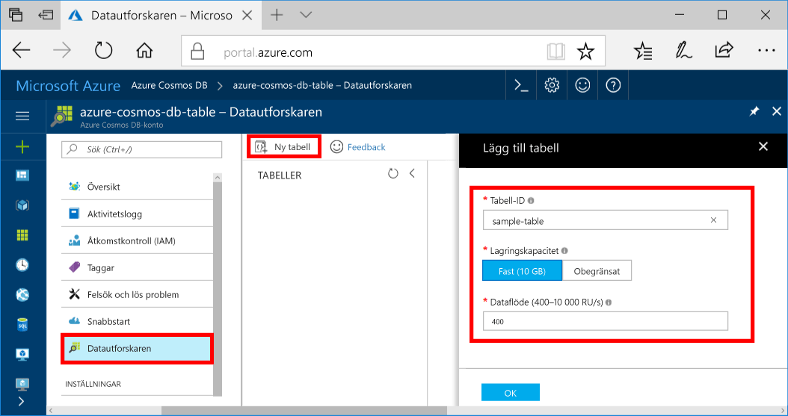

Du kan nu använda Data Explorer toocreate en tabell och lägga till data tooyour databas. 

1. Klicka på hello Azure-portalen i hello navigeringsmenyn **Data Explorer (förhandsgranskning)**. 
2. I hello Data Explorer-bladet, klickar du på **ny tabell**, fyll sedan i hello sida med hello följande information.

    

    Inställning|Föreslaget värde|Beskrivning
    ---|---|---
    Tabell-id|sample-table|hello-ID för den nya tabellen. Tabellnamn har hello samma tecken krav som databas-ID: n. Databasnamn måste innehålla mellan 1 och 255 tecken och får inte innehålla `/ \ # ?` eller avslutande blanksteg.
    Lagringskapacitet| 10 GB|Lämna hello standardvärdet. Detta är hello lagringskapaciteten för hello-databasen.
    Dataflöde|400 RU:er|Lämna hello standardvärdet. Du kan skala upp hello [genomströmning](../articles/cosmos-db/request-units.md) senare om du vill tooreduce svarstid.

3. När hello formuläret, klickar du på **OK**.
