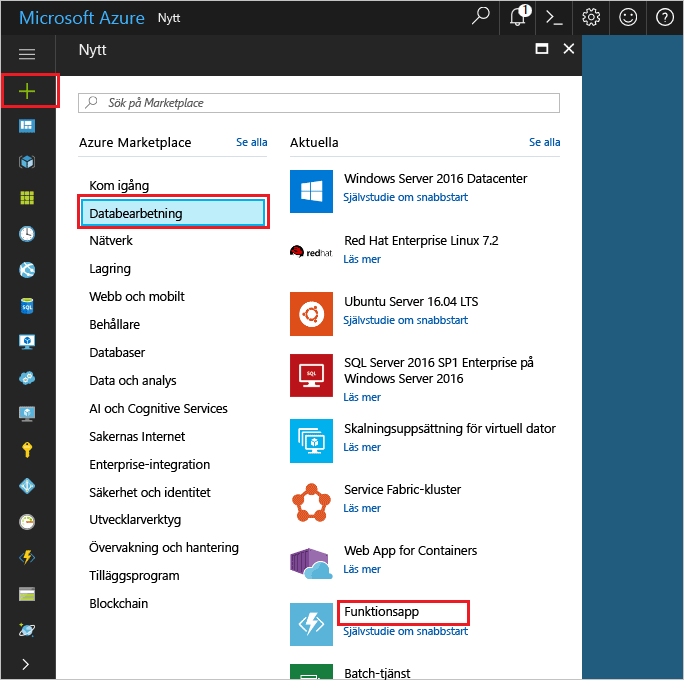

1. Klicka på hello **ny** knappen hittades på hello övre vänstra hörnet av hello Azure-portalen.

1. Klicka på **Beräkna** > **Funktionsapp** och välj din **prenumeration**. Använd sedan hello funktionen app-inställningar som anges i hello tabell.

    

    | Inställning      | Föreslaget värde  | Beskrivning                                        |
    | ------------ |  ------- | -------------------------------------------------- |
    | **Appens namn** | Globalt unikt namn | Namn som identifierar din nya funktionsapp. | 
    | **[Resursgrupp](../articles/azure-resource-manager/resource-group-overview.md)** |  myResourceGroup | Namn för hello ny resursgrupp i vilka toocreate funktionen appen. | 
    | **[Värdplan](../articles/azure-functions/functions-scale.md)** |   Förbrukningsplan | Värd för planen som definierar hur resurser allokeras tooyour funktionsapp. I hello standard **förbrukning planera**, resurser läggs till dynamiskt som krävs av dina funktioner. Du betalar bara för hello tid kör dina funktioner.   |
    | **Plats** | Västra Europa | Välj en plats nära dig eller nära andra tjänster som kommer att användas i dina funktioner. |
    | **[Lagringskonto](../articles/storage/common/storage-create-storage-account.md#create-a-storage-account)** |  Globalt unikt namn |  Namnet på hello nytt lagringskonto används av appen funktion. Namnet på ett lagringskonto måste vara mellan 3 och 24 tecken långt och får endast innehålla siffror och gemener. Du kan också använda ett befintligt konto. |

1. Klicka på **skapa** tooprovision och distribuera hello ny funktionsapp.
