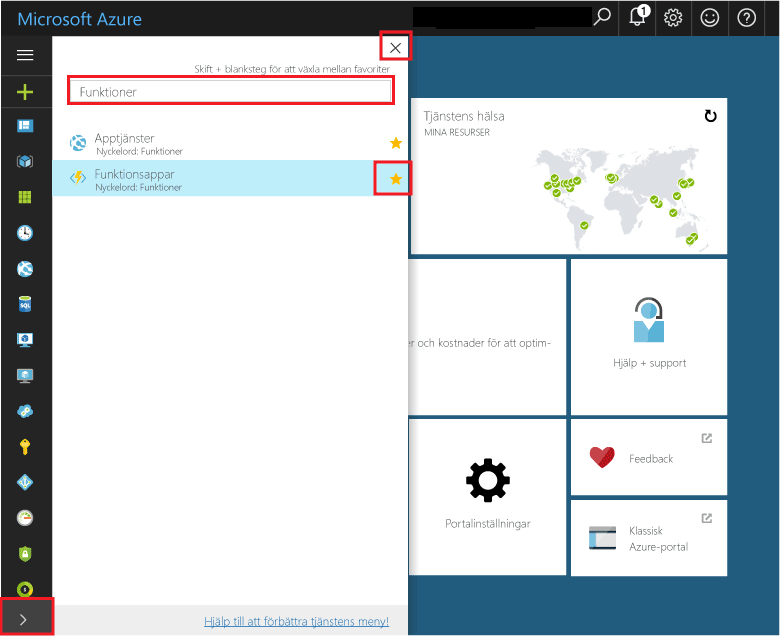
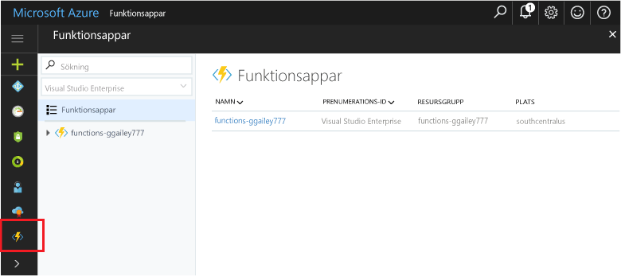

## Lägg till funktionen appar tooyour portal Favoriter 

Om du inte redan gjort det, kan du lägga till funktionen appar tooyour Favoriter i hello Azure-portalen. Detta gör det enklare toofind funktionen-appar. Om du redan har gjort det, kan du hoppa över toohello nästa avsnitt. 

1. Logga in toohello [Azure-portalen](https://portal.azure.com/).

2. Klicka på hello pilen i hello nedre vänstra tooexpand alla tjänster, skriver `Functions` i hello **Filter** fält och klicka på stjärna hello bredvid för**funktionen appar**.  
 
    

    Detta lägger till hello funktioner ikonen toohello menyn hello till vänster i hello-portalen.

3. Stäng hello-menyn och sedan rullar toohello nedre toosee hello funktioner ikon. Klicka på den här ikonen toosee en lista över alla dina appar i funktionen. Klicka på din funktion app toowork med funktioner i den här appen. 
 
    
 
     