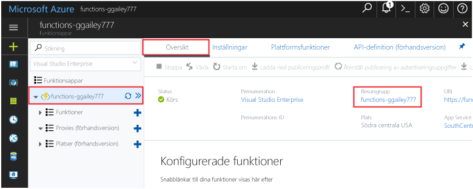

Andra snabbstarter i den här samlingen bygger på den här snabbstarten. Om du tänker toocontinue toowork med efterföljande snabbstarter eller hello självstudier, rensa hello resurser som skapas på den här quick starta inte. 

Om du inte planerar toocontinue klickar du på hello **resursgruppen** för hello funktionsapp i hello portal och klicka sedan på **ta bort**. 

