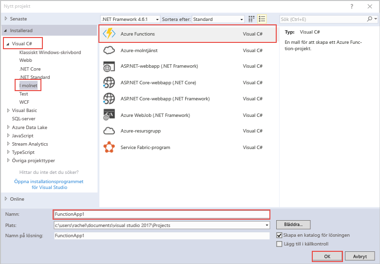

Med Azure Functions-projektmallen i Visual Studio skapas ett projekt som kan publiceras till en funktionsapp i Azure.The Azure Functions project template in Visual Studio creates a project that can be published to a function app in Azure. I en funktionsapp kan du gruppera funktioner som en logisk enhet så att det blir enklare att hantera, distribuera och dela resurser.A function app lets you group functions as a logic unit for easier management, deployment, and sharing of resources.   

1. Högerklicka på projektnoden i **Solution Explorer** och välj sedan **Lägg till** > **Nytt objekt**.Right mouse click on the project node in **Solution Explorer**, then choose **Add** > **New Item**. Välj **Azure Function** i dialogrutan.Choose **Azure Function** from the dialog box.

2. I dialogrutan **Nytt projekt** expanderar du noden **Visual C#** > **Cloud**, väljer **Azure Functions**, anger ett **namn** för projektet och klickar på **OK**.In the **New Project** dialog, expand **Visual C#** > **Cloud** node, select **Azure Functions**, type a **Name** for your project, and click **OK**. Funktionsappens namn måste vara ett giltigt C#-namnområde. Du kan inte använda understreck, bindestreck eller andra icke-alfanumeriska tecken.The function app name must be valid as a C# namespace, so don't use underscores, hyphens, or any other nonalphanumeric characters. 

    