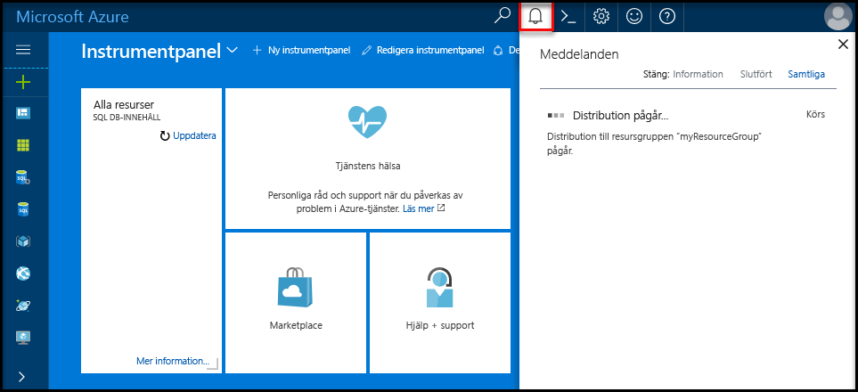

## Logga in toohello Azure-portalenLog in toohello Azure portal

Logga in toohello [Azure-portalen](https://portal.azure.com/).Log in toohello [Azure portal](https://portal.azure.com/).

## Skapa en tom SQL-databas med hjälp av hello Azure-portalenCreate a blank SQL database using hello Azure portal

Azure SQL-databasen skapas med en definierad uppsättning [beräknings-och lagringsresurser](../articles/sql-database/sql-database-service-tiers.md).An Azure SQL database is created with a defined set of [compute and storage resources](../articles/sql-database/sql-database-service-tiers.md). hello-databas skapas inom en [Azure-resursgrupp](../articles/azure-resource-manager/resource-group-overview.md) och i en [logisk Azure SQL Database-server](../articles/sql-database/sql-database-features.md).hello database is created within an [Azure resource group](../articles/azure-resource-manager/resource-group-overview.md) and in an [Azure SQL Database logical server](../articles/sql-database/sql-database-features.md). 

Följ dessa steg toocreate en tom SQL-databas.Follow these steps toocreate a blank SQL database. 

1. Klicka på hello **ny** knappen hittades på hello övre vänstra hörnet av hello Azure-portalen.Click hello **New** button found on hello upper left-hand corner of hello Azure portal.

2. Välj **databaser** från hello **ny** och väljer **SQL-databas** från hello **databaser** sidan.Select **Databases** from hello **New** page, and select **SQL Database** from hello **Databases** page. 

   

3. Fyll i formuläret om hello SQL-databas med hello följande information som visas i föregående bild hello:Fill out hello SQL Database form with hello following information, as shown on hello preceding image:   

   | InställningSetting | Föreslaget värdeSuggested value | BeskrivningDescription |
   | --------| --------------- | ----------- | 
   | **Databasnamn****Database name** | mySampleDatabasemySampleDatabase | För giltiga databasnamn, se [databasidentifierare](https://docs.microsoft.com/sql/relational-databases/databases/database-identifiers).For valid database names, see [Database Identifiers](https://docs.microsoft.com/sql/relational-databases/databases/database-identifiers). | 
   | **Prenumeration****Subscription** | Din prenumerationYour subscription  | Mer information om dina prenumerationer finns i [Prenumerationer](https://account.windowsazure.com/Subscriptions).For details about your subscriptions, see [Subscriptions](https://account.windowsazure.com/Subscriptions). |
   | **Resursgrupp****Resource group** | myResourceGroupmyResourceGroup | Giltiga resursgruppnamn finns i [Namngivningsregler och begränsningar](https://docs.microsoft.com/azure/architecture/best-practices/naming-conventions).For valid resource group names, see [Naming rules and restrictions](https://docs.microsoft.com/azure/architecture/best-practices/naming-conventions). |
   | **Välj källa****Select source** | Tom databasBlank database | Anger att en tom databas ska skapas.Specifies that a blank database should be created. |
   ||||

4. Klicka på **Server** toocreate och konfigurera en ny server för den nya databasen.Click **Server** toocreate and configure a new server for your new database. Fyll i hello **nytt serverformulär** med hello följande information:Fill out hello **New server form** with hello following information: 

   | InställningSetting | Föreslaget värdeSuggested value | BeskrivningDescription |
   | --------| --------------- | ----------- | 
   | **Servernamn****Server name** | Ett globalt unikt namn.Any globally unique name. | Giltiga servernamn finns i [Namngivningsregler och begränsningar](https://docs.microsoft.com/azure/architecture/best-practices/naming-conventions).For valid server names, see [Naming rules and restrictions](https://docs.microsoft.com/azure/architecture/best-practices/naming-conventions). | 
   | **Inloggning för serveradministratör****Server admin login** | Ett giltigt namn.Any valid name. | För giltiga inloggningsnamn, se [Databasidentifierare](https://docs.microsoft.com/sql/relational-databases/databases/database-identifiers).For valid login names, see [Database Identifiers](https://docs.microsoft.com/sql/relational-databases/databases/database-identifiers).|
   | **Lösenord****Password** | Alla giltiga lösenord.Any valid password. | Lösenordet måste innehålla minst åtta tecken och måste innehålla tecken från tre av hello följande kategorier: versaler, gemener, siffror och specialtecken.Your password must have at least eight characters and must contain characters from three of hello following categories: upper case characters, lower case characters, numbers, and non-alphanumeric characters. |
   | **Plats****Location** | Någon giltig plats.Any valid location. | För information om regioner, se [Azure-regioner](https://azure.microsoft.com/regions/).For information about regions, see [Azure Regions](https://azure.microsoft.com/regions/). |
   ||||

   

5. Klicka på **Välj**.Click **Select**.

6. Klicka på **prisnivå** toospecify hello tjänstnivå och prestandanivå servicenivå för den nya databasen.Click **Pricing tier** toospecify hello service tier and performance level for your new database. Den här kursen väljer **20 dtu: er** och **250** GB lagringsutrymme.For this tutorial, select **20 DTUs** and **250** GB of storage.

   

7. Klicka på **Använd**.Click **Apply**.  

8. Välj en **sorteringen** för hello tom databas (för den här kursen används hello standardvärdet).Select a **collation** for hello blank database (for this tutorial, use hello default value). Mer information om sorteringar finns [sorteringar](https://docs.microsoft.com/sql/t-sql/statements/collations)For more information about collations, see [Collations](https://docs.microsoft.com/sql/t-sql/statements/collations)

9. Klicka på **skapa** tooprovision hello-databasen.Click **Create** tooprovision hello database. Etablering tar om en minut och en halv toocomplete.Provisioning takes about a minute and a half toocomplete. 

10. På verktygsfältet hello **meddelanden** toomonitor hello distributionsprocessen.On hello toolbar, click **Notifications** toomonitor hello deployment process.

   

## Skapa en brandväggsregel på servernivå med hjälp av hello Azure-portalenCreate a server-level firewall rule using hello Azure portal

hello SQL Database-tjänsten skapar en brandvägg på servernivå för hello.hello SQL Database service creates a firewall at hello server-level. Hello brandvägg förhindrar ursprungligen externa verktyg och program från att ansluta toohello server eller tooany databaser på hello-servern.Initially hello firewall prevents external tools and applications from connecting toohello server, or tooany databases on hello server. Anslutningar tillåts efter en brandväggsregel skapas tooopen specifika IP-adresser.Connections are allowed after a firewall rule is created tooopen specific IP addresses. Följ dessa steg toocreate en [SQL-databas brandväggsregel på servernivå](../articles/sql-database/sql-database-firewall-configure.md) för din klients IP-adress och tooenable extern anslutning via hello SQL Database-Brandvägg för din IP-adress.Follow these steps toocreate a [SQL Database server-level firewall rule](../articles/sql-database/sql-database-firewall-configure.md) for your client's IP address, and tooenable external connectivity through hello SQL Database firewall for your IP address only. 

> [!NOTE]
> Azure SQL Database kommunicerar via port 1433.Azure SQL Database communicates over port 1433. Du kan ansluta tooSQL databasen förrän hello brandväggen i ditt nätverk tillåter att utgående trafik via port 1433.You can connect tooSQL Database only after hello firewall of your network allows outbound traffic through port 1433.

1. När hello distributionen är klar klickar du på **SQL-databaser** från hello vänstra menyn och klicka sedan på **mySampleDatabase** på hello **SQL-databaser** sidan.After hello deployment completes, click **SQL databases** from hello left-hand menu and then click **mySampleDatabase** on hello **SQL databases** page. hello översiktssidan för din databas öppnas som visar du hello fullständigt kvalificerade servernamnet (exempelvis **mynewserver20170313.database.windows.net**) och innehåller alternativ för ytterligare konfiguration.hello overview page for your database opens, showing you hello fully qualified server name (such as **mynewserver20170313.database.windows.net**) and provides options for further configuration. Kopiera det fullständiga servernamnet för senare användning.Copy this fully qualified server name for use later.

   > [!IMPORTANT]
   > Du behöver den här fullständigt kvalificerade namnet tooconnect tooyour-server och dess databaser i efterföljande snabbstarter.You need this fully qualified server name tooconnect tooyour server and its databases in subsequent quick starts.
   > 

    

2. Klicka på **ange serverbrandvägg** hello verktygsfältet enligt hello föregående bild.Click **Set server firewall** on hello toolbar as shown in hello previous image. Hej **brandväggsinställningar** öppnas sidan för hello SQL Database-server.hello **Firewall settings** page for hello SQL Database server opens. 

    

3. Klicka på **lägga till klientens IP-Adressen** på hello verktygsfältet tooadd din aktuella IP-adressen tooa ny brandväggsregel.Click **Add client IP** on hello toolbar tooadd your current IP address tooa new firewall rule. Med en brandväggsregel kan du öppna port 1433 för en enskild IP-adress eller för IP-adressintervall.A firewall rule can open port 1433 for a single IP address or a range of IP addresses.

4. Klicka på **Spara**.Click **Save**. En brandväggsregel på servernivå har skapats för din aktuella IP-adress som är öppna port 1433 på hello logisk server.A server-level firewall rule is created for your current IP address opening port 1433 on hello logical server.

    

4. Klicka på **OK** och stäng sedan hello **brandväggsinställningar** sidan.Click **OK** and then close hello **Firewall settings** page.

Du kan ansluta toohello Azure SQL Database-server och dess databaser genom att använda ett verktyg som SQL Server Management Studio (SSMS).You can now connect toohello Azure SQL Database server and its databases by using a tool such as SQL Server Management Studio (SSMS). hello anslutningen är från den här IP-adressen och den använder hello server administratörskonto som skapats tidigare.hello connection is from this IP address, and it uses hello server admin account created previously.

> [!IMPORTANT]
> Som standard är åtkomst via hello SQL Database-brandvägg aktiverad för alla Azure-tjänster.By default, access through hello SQL Database firewall is enabled for all Azure services. Klicka på **OFF** på den här sidan toodisable för alla Azure-tjänster.Click **OFF** on this page toodisable for all Azure services.

## Hämta anslutningssträngarnas värden med hjälp av hello Azure-portalenGet connection string values using hello Azure portal

Hämta hello fullständigt kvalificerade servernamnet för din Azure SQL Database-server i hello Azure-portalen.Get hello fully qualified server name for your Azure SQL Database server in hello Azure portal. Du kan använda hello fullständiga server name tooconnect tooyour servern med hjälp av SQL Server Management Studio.You use hello fully qualified server name tooconnect tooyour server using SQL Server Management Studio.

1. Logga in toohello [Azure-portalen](https://portal.azure.com/).Log in toohello [Azure portal](https://portal.azure.com/).

2. Välj **SQL-databaser** vänstra hello-menyn och klicka på din databas på hello **SQL-databaser** sidan.Select **SQL Databases** from hello left-hand menu, and click your database on hello **SQL databases** page. 

3. I hello **Essentials** rutan i hello Azure Portalsida för databasen, leta upp och sedan kopiera hello **servernamn**.In hello **Essentials** pane in hello Azure portal page for your database, locate and then copy hello **Server name**.

    
